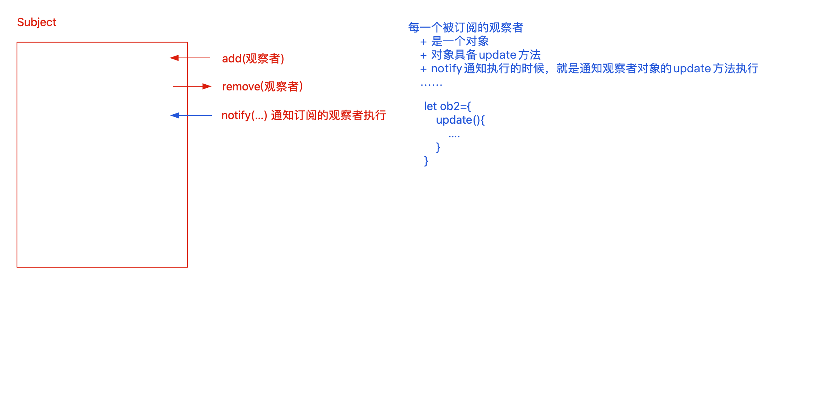

# 设计模式

设计模式仅仅是“锦上添花”！设计模式是一种思想，基于这种思想可以更好的去管理代码！

- 单例设计模式
- 工厂设计模式
- 构造函数设计模式
- Promise承诺者设计模式
- 发布/订阅设计模式「自定义事件」
- 观察者设计模式
- ...

## 发布/订阅模式

### 全局事件总线

```js
(function () {
    // 自定义事件池
    let listeners = {};

    // 校验的处理
    const checkName = name => {
        if (typeof name !== "string") throw new TypeError('name is not a string!')
    };
    const checkFunc = func => {
        if (typeof func !== "function") throw new TypeError('func is not a function!')
    };

    // 向事件池中加入方法
    const on = function on(name, func) {
        checkName(name);
        checkFunc(func);
        // 判断事件池中是否存在这个事件
        if (!listeners.hasOwnProperty(name)) listeners[name] = [];
        let arr = listeners[name];
        // 去重处理
        if (arr.indexOf(func) >= 0) return;
        arr.push(func);
    };

    // 从事件池中移除方法
    const off = function off(name, func) {
        checkName(name);
        checkFunc(func);
        let arr = listeners[name];
        if (!arr) return;
        for (let i = 0; i < arr.length; i++) {
            let item = arr[i];
            if (item === func) {
                // 把这一项移除掉：为了避免数据塌陷问题，先赋值为null
                // arr.splice(i, 1);
                arr[i] = null;
                break;
            }
        }
    };

    // 通知指定事件池中的方法执行
    const emit = function emit(name, ...params) {
        checkName(name);
        let arr = listeners[name];
        if (!arr) return;
        // 通知集合中的每个方法执行
        for (let i = 0; i < arr.length; i++) {
            let item = arr[i];
            if (item === null) {
                // 此时把为null项从集合中移除掉
                arr.splice(i, 1);
                i--;
                continue;
            }
            item(...params);
        }
    };

    // 暴露API
    window.$sub = {
        on,
        off,
        emit
    };
})();

/* 测试 */
setTimeout(() => {
    $sub.emit('AA', 10, 20);

    setTimeout(() => {
        $sub.emit('AA', 100, 200);
    }, 2000);
}, 2000);

const fn1 = (x, y) => {
    console.log('fn1', x, y);
};
const fn2 = (x, y) => {
    console.log('fn2', x, y);
    // 第一次执行到FN2的时候，从事件池中移除FN1/FN2
    $sub.off('AA', fn1);
    $sub.off('AA', fn2);
};
const fn3 = (x, y) => console.log('fn3', x, y);
const fn4 = (x, y) => console.log('fn4', x, y);
const fn5 = (x, y) => console.log('fn5', x, y);
const fn6 = (x, y) => console.log('fn6', x, y);
$sub.on('AA', fn1);
$sub.on('AA', fn2);
$sub.on('AA', fn3);
$sub.on('AA', fn2);
$sub.on('AA', fn3);
$sub.on('AA', fn4);
$sub.on('AA', fn5);
$sub.on('AA', fn6);
$sub.on('BB', fn1);
$sub.on('BB', fn2);
```

> off 中不直接 splice，而是先置为 null，emit 时再统一删除。避免数值下标塌陷

### 单事件发布订阅

```js
(function () {
    class Sub {
        // 定义实例的私有事件池
        listeners = []; //0x000

        // 定义原型上通用的方法
        add(func) {
            if (typeof func !== "function") throw new TypeError("function is not a function!");
            let { listeners } = this;
            if (listeners.includes(func)) return;
            listeners.push(func);
        }
        remove(func) {
            if (typeof func !== "function") throw new TypeError("function is not a function!");
            let { listeners } = this;
            this.listeners = listeners.map(item => {
                if (item === func) return null;
                return item;
            });
        }
        fire(...params) {
            let { listeners } = this;
            for (let i = 0; i < listeners.length; i++) {
                let item = listeners[i];
                if (item === null) {
                    listeners.splice(i, 1);
                    i--;
                    continue;
                }
                item(...params);
            }
        }
    }

    /* 暴露API */
    if (typeof window !== "undefined") window.Sub = Sub;
    if (typeof module === "object" && typeof module.exports === "object") module.exports = Sub;
})();

/* 测试 */
setTimeout(() => {
    s1.fire(10, 20);

    setTimeout(() => {
        s2.fire(100, 200);
    }, 2000);
}, 2000);

const fn1 = (x, y) => {
    console.log('fn1', x, y);
};
const fn2 = (x, y) => {
    console.log('fn2', x, y);
    s1.remove(fn1);
    s1.remove(fn2);
};
const fn3 = (x, y) => console.log('fn3', x, y);
const fn4 = (x, y) => console.log('fn4', x, y);
const fn5 = (x, y) => console.log('fn5', x, y);
const fn6 = (x, y) => console.log('fn6', x, y);

let s1 = new Sub;
s1.add(fn1);
s1.add(fn2);
s1.add(fn3);
s1.add(fn4);
s1.add(fn5);
s1.add(fn6);

let s2 = new Sub;
s2.add(fn4);
s2.add(fn5);
s2.add(fn6);
```

### 两者对比

| 对比项               | 全局事件总线                             | 单事件发布订阅                   |
| -------------------- | ---------------------------------------- | -------------------------------- |
| 数据结构             | `{eventName: []}`                        | `[]`                             |
| 一个对象支持几个事件 | 多个                                     | 一个                             |
| 是否需要事件名       | 是                                       | 否                               |
| 应用场景             | EventBus、Node.js EventEmitter、DOM 事件 | Promise、Ajax 回调、单个任务通知 |
| 扩展性               | 更高                                     | 更轻量                           |
| 耦合度               | 一个中心管理所有事件                     | 一个实例管理一个事件             |

## 观察者模式

当一个对象（Subject，目标对象）状态发生变化时，会自动通知所有依赖它的对象（Observer，观察者），使它们能够及时更新。

比如多个用户关注了一个up主

```
          UP主（Subject）
                │
      ┌─────────┼─────────┐
      │         │         │
   用户A     用户B     用户C
 (Observer)(Observer)(Observer)
```

当 UP 主发布新视频时，进行通知，所有用户都接受到通知

```js
class Subject {
    observerList = [];

    // 校验观察者的格式
    checkObserver(observer) {
        if (observer !== null && /^(object|function)$/.test(typeof observer)) {
            if (typeof observer.update === "function") {
                return true;
            }
        }
        throw new TypeError("Illegal observer");
    }
    add(observer) {
        this.checkObserver(observer);
        let { observerList } = this;
        if (observerList.includes(observer)) return;
        observerList.push(observer);
    }
    remove(observer) {
        this.checkObserver(observer);
        let { observerList } = this;
        this.observerList = observerList.map(item => {
            if (item === observer) return null;
            return item;
        });
    }
    notify(...params) {
        let { observerList } = this;
        for (let i = 0; i < observerList.length; i++) {
            let item = observerList[i];
            if (item === null) {
                observerList.splice(i, 1);
                i--;
                continue;
            }
            item.update(...params);
        }
    }
}

// 定义多个观察者
let observer1 = {
    update(...params) {
        console.log('我是观察者1：', params);
    }
};

class Observer {
    update(...params) {
        console.log('我是观察者2：', params);
    }
}

const sub = new Subject;
sub.add(observer1);
sub.add(new Observer);

setTimeout(() => {
    sub.notify(100, 200);
}, 2000);
```

