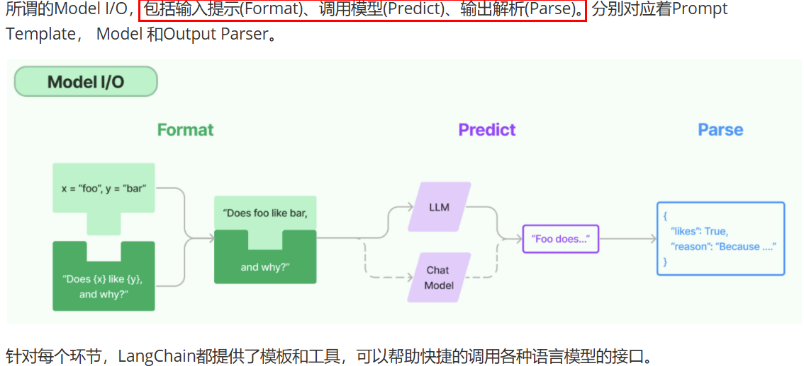
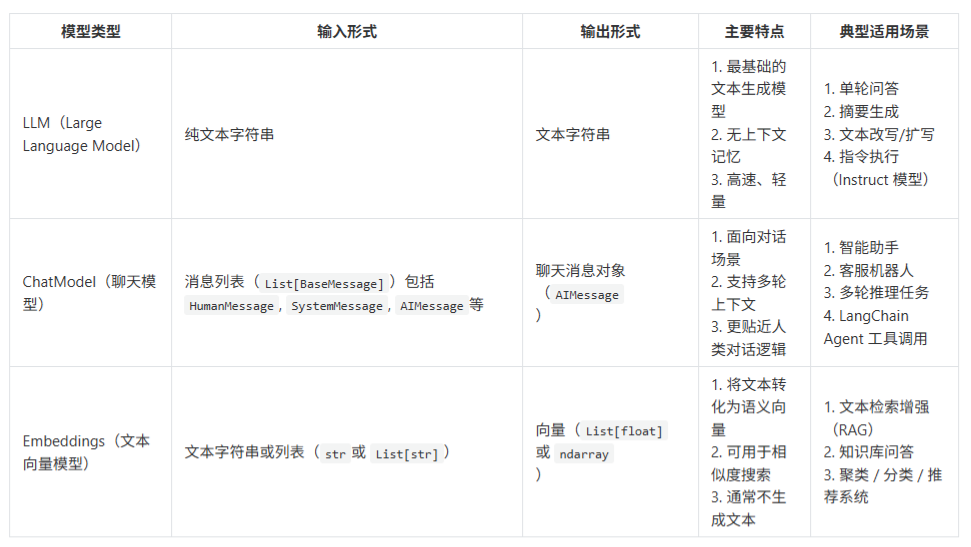
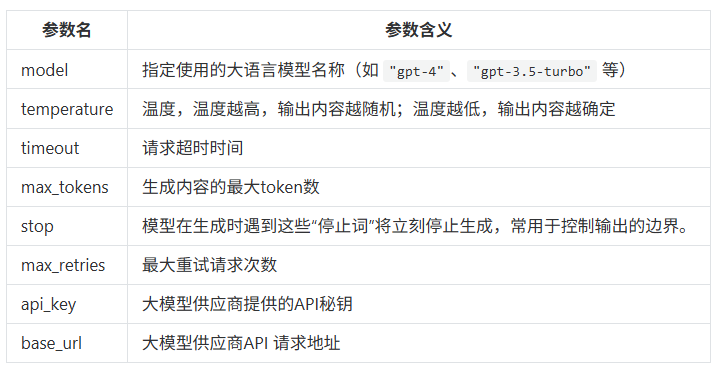
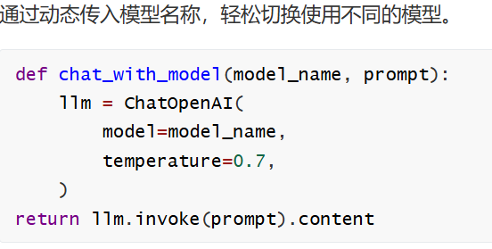
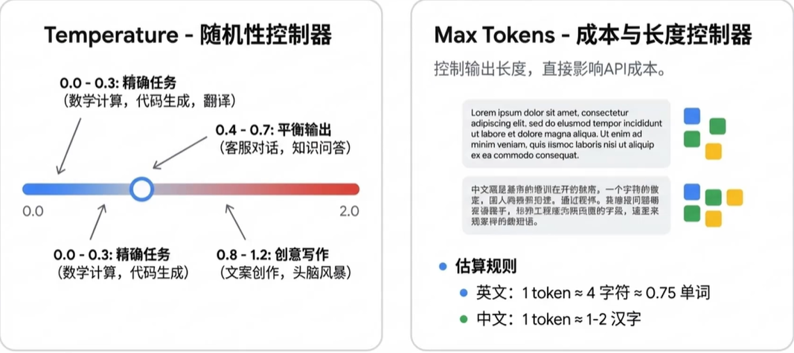
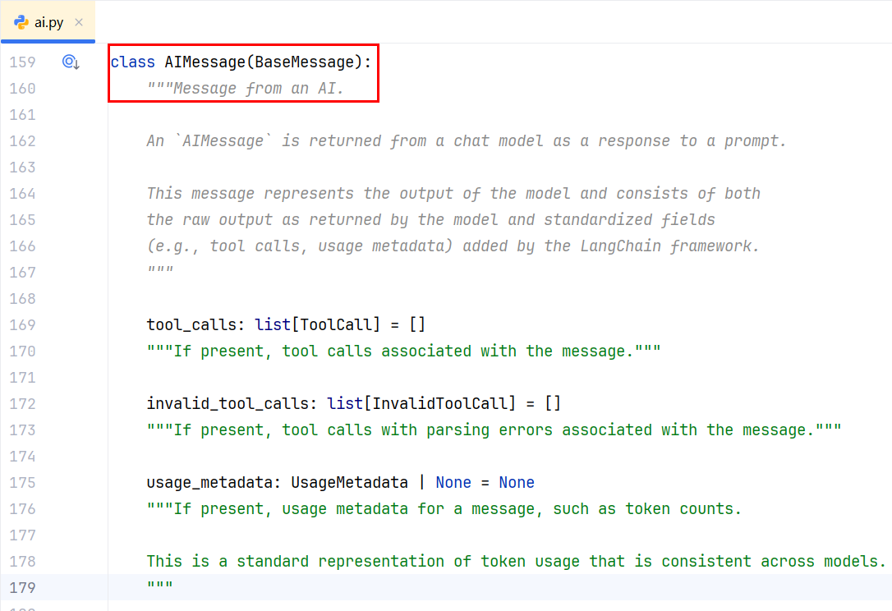
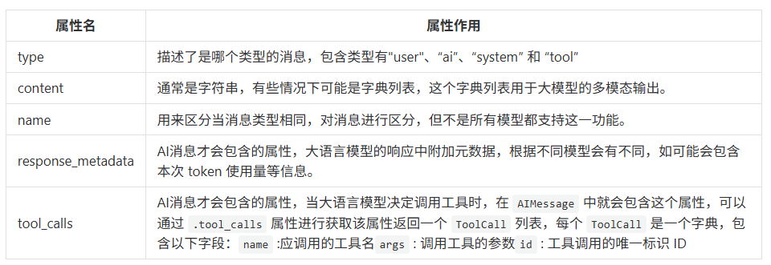

# Model IO

## model io 是什么

LangChain 的 Model I/O 模块是与大模型进行交互的核心组件
Model I/O：标准化各个大模型的输入和输出，包含输入模版，模型本身和格式化输出。



## model io 三件套

- 输入提示（format）：即指代Prompts Template提示词模板，通过模板管理大模型的输入。
  将原始数据格式化成模型可以处理的形式，插入到一个模板问题中，然后送入模型进行处理
- 调用模型（predict）：即指代Models，使用通用接口调用不同的大语言模型。接受被送进来的问题，然后基于这个问题进行预测或生成回答。
- 输出解析（parse）：即指代Output Parser 部分，用来从模型的推理中提取信息，并按照预先设定好的模版来规范化输出。比如，格式化成一个结构化的JSON对象

> 简单来说，就是输入、处理、输出这三个步骤。

## model io 调用模型

一个 AI 应用的核心就是它所依赖的大语言模型，LangChain作为一个“工具”，不提供任何 LLMs，而是依赖于第三方集成各种大模型。比如：将 OpenAI、Anthropic、Hugging Face 、LlaMA、阿里Qwen、ChatGLM等平台的模型无缝接入到你的应用。

LangChain模型接口可参考[官方文档](https://reference.langchain.com/python/langchain_core/language_models/)

## model io 分类

LangChain中将大语言模型分为以下几种，我们主要使用的是聊天对话模型



## model io 模型参数

[官方文档](https://docs.langchain.com/oss/python/langchain/models#parameters)

在构建聊天模型时init_chat_model，有一些标准化参数



以上的标准参数，也只是适用于部分的大语言模型，有些参数在特定模型中可能是无效的，这些标准化参数仅对 LangChain 官方提供集成包的模型（如 langchain-openai、langchain-anthropic）生效，在langchain-community包中的第三方模型，则不需要遵守这些标准化参数的规则。



### temperature 随机性控制器



## model io 模型返回

Message组件

调用模型后返回了一条AI消息:  AIMessage



所有消息都有 type 、 content 、 response_metadata 等属性



## 接入大模型

[官方文档](https://docs.langchain.com/oss/python/integrations/providers/overview)

### 接入openai

openai有两种方式可以进行选择openai.OpenAI 和 langchain_openai.ChatOpenAI 

langchain_openai.ChatOpenAI 的区别及选型建议：

1. 核心结论

> 两者定位、功能场景差异显著，无绝对优劣，需根据业务需求选择
>
> 本质区别：openai.OpenAI 是官方原生底层工具，langchain_openai.ChatOpenAI 是LangChain 生态的高层适配器；
>
> 选型核心：简单调用用 openai.OpenAI（轻、快、纯），复杂工作流用 langchain_openai.ChatOpenAI（强、全、易扩展）

2. 核心定位与所属生态的差异

> openai.OpenAI 
>
> 所属生态：OpenAI 官方 Python SDK（包名：openai），是 OpenAI 官方提供的原生工具；
>
> 核心定位：底层、纯粹的 API 调用工具，仅负责封装 OpenAI 的 API 接口，提供最直接的模型调用能力，无额外扩展功能；
>
> 设计目标：让开发者快速、精准地调用 OpenAI 的各类模型（Chat、Completion、Embeddings 等），贴近原生 API 参数，无冗余封装。

> langchain_openai.ChatOpenAI
>
> 所属生态：LangChain 框架（包名：langchain-openai，LangChain v1.x 模块化拆分后的独立包），是 LangChain 对 OpenAI SDK 的二次封装；
>
> 核心定位：LangChain 框架的「模型适配器」，将 OpenAI 的聊天模型能力适配到 LangChain 的生态中，使其能与 LangChain 的其他组件（提示词模板、链、代理、记忆等）无缝协作；
>
> 设计目标：让 OpenAI 模型融入复杂的 LLM 应用工作流，无需开发者手动处理组件间的适配逻辑

OpenAI 方式示例代码

```python
# Please install OpenAI SDK first: `pip install openai`
import os
from openai import OpenAI
from dotenv import load_dotenv

load_dotenv()

client = OpenAI(
    api_key=os.getenv("XIAOMI_API_KEY"),
    base_url="https://token-plan-cn.xiaomimimo.com/v1",
)

response = client.chat.completions.create(
    model="mimo-v2.5",
    messages=[
        {"role": "system", "content": "You are a helpful assistant"},
        {"role": "user", "content": "Hello,你是谁"},
    ],
    stream=False,
)

print(response.choices[0].message.content)
```

ChatOpenAI 方式示例代码

```python
from langchain_openai import ChatOpenAI
import os
from dotenv import load_dotenv
from pydantic import SecretStr

load_dotenv()

api_key = os.getenv("XIAOMI_API_KEY")

chatLLM = ChatOpenAI(
    api_key=SecretStr(api_key) if api_key else None,
    base_url="https://token-plan-cn.xiaomimimo.com/v1",
    model="mimo-v2.5",
    # other params...
)

messages = [
    {"role": "system", "content": "You are a helpful assistant."},
    {"role": "user", "content": "你是谁？"},
]

response = chatLLM.invoke(messages)

print(response.content)
```

init_chat_model 方式示例代码

```python
# 1.导入依赖
import os
from langchain.chat_models import init_chat_model
from dotenv import load_dotenv

load_dotenv()

# 2.实例化模型
model = init_chat_model(
    model="mimo-v2.5",
    model_provider="openai",  # 1.0版本需要指定模型提供商，默认支持的提供商可以省略 model_provider
    api_key=os.getenv("XIAOMI_API_KEY"),
    base_url="https://token-plan-cn.xiaomimimo.com/v1",
)

# 3.调用模型
print(model.invoke("你是谁").content)
```

### 接入deepseek

[官方文档](https://docs.langchain.com/oss/python/integrations/providers/deepseek)

示例代码

```python
import os
from langchain_deepseek import ChatDeepSeek
from dotenv import load_dotenv
from pydantic import SecretStr

load_dotenv()

api_key = os.getenv("DEEPSEEK_API_KEY")

# 初始化 deepseek
# 看看ChatDeepSeek类的源码，解释了为什么不写调用地址，chat_modesl.py源码第176行
model = ChatDeepSeek(
    model="deepseek-chat",
    temperature=0,
    max_tokens=None,
    timeout=None,
    max_retries=2,
    api_key=SecretStr(api_key) if api_key else None,
)

# 打印结果
print(model.invoke("什么是LangChain?20字以内回答，简洁"))
```

### 接入QWen

[官方文档](https://bailian.console.aliyun.com/cn-beijing/?tab=api#/api/?type=model&url=2587654)

使用 dashscope 的示例代码，也可以使用OpenAI的方式接入

```python
# uv add langchain-community
# uv add dashscope
import os
from langchain_community.chat_models.tongyi import ChatTongyi
from langchain_core.messages import HumanMessage
from dotenv import load_dotenv

load_dotenv()

chatLLM = ChatTongyi(
    model="qwen-plus",
    dashscope_api_key=os.getenv("QWEN_API_KEY"),
    # api_key=os.getenv("QWEN_API_KEY"),
    streaming=True,
    # other params...
)
# 打印结果
print(chatLLM.invoke("你是谁"))

print("*" * 60)

res = chatLLM.stream([HumanMessage(content="你好，你是谁")], streaming=True)
for r in res:
    print("chat resp:", r.content)
```

