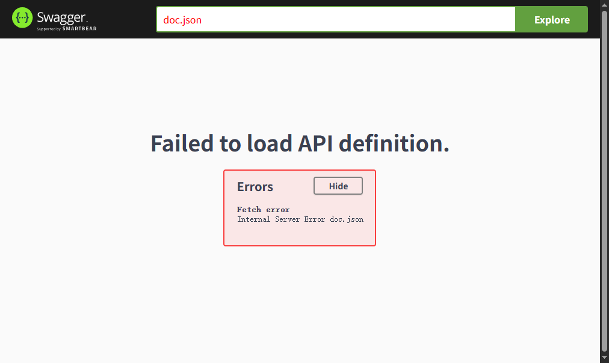
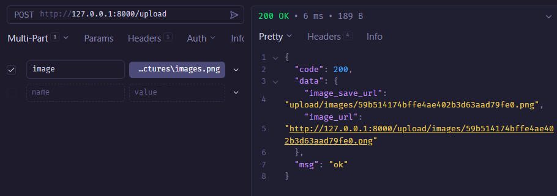
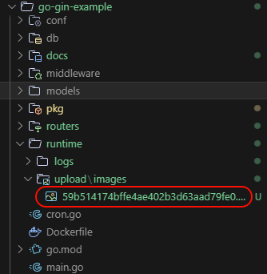

# Gin-Example

> 目标：写一个博客的接口

## 初始化目录

- conf：用于存储配置文件
- middleware：应用中间件
- models：应用数据库模型
- pkg：第三方包
- routers 路由逻辑处理
- runtime：应用运行时数据

## Go Modules Replace

打开 `go.mod` 文件，新增 `replace` 配置项，使用的是完整的外部模块引用路径（`github.com/fzzv/go-gin-example/xxx`），而这个模块还没推送到远程，是没有办法下载下来的，因此需要用 `replace` 将其指定读取本地的模块路径，这样子就可以解决本地模块读取的问题

```go
module github.com/fzzv/go-gin-example

go 1.24.6

require (
	github.com/gin-gonic/gin v1.11.0
	github.com/go-ini/ini v1.67.0
)

require (...)

replace (
	github.com/fzzv/go-gin-example/conf => E:/other-project/web-note/code/go/go-gin-example/pkg/conf
	github.com/fzzv/go-gin-example/middleware => E:/other-project/web-note/code/go/go-gin-example/middleware
	github.com/fzzv/go-gin-example/models => E:/other-project/web-note/code/go/go-gin-example/models
	github.com/fzzv/go-gin-example/pkg/e => E:/other-project/web-note/code/go/go-gin-example/pkg/e
	github.com/fzzv/go-gin-example/pkg/setting => E:/other-project/web-note/code/go/go-gin-example/pkg/setting
	github.com/fzzv/go-gin-example/routers => E:/other-project/web-note/code/go/go-gin-example/routers
)
```

## 一些第三方包

- github.com/go-ini/ini：用于编写应用配置文件
- github.com/unknwon/com：提供一组**实用的通用函数（helper functions）**，用于字符串、文件、类型转换、切片、结构体反射等常见任务
- github.com/jinzhu/gorm：Go 对象关系映射框架
- github.com/astaxie/beego/validation：用于数据验证
- github.com/dgrijalva/jwt-go：jwt依赖包

## 简单的demo

```go
package main

import (
	"fmt"
	"net/http"

	"github.com/gin-gonic/gin"

	"github.com/fzzv/go-gin-example/pkg/setting"
)

func main() {
	// 返回Gin的type Engine struct{...}，里面包含RouterGroup，
	// 相当于创建一个路由Handlers，可以后期绑定各类的路由规则和函数、中间件等
	router := gin.Default()
	// 创建不同的HTTP方法绑定到Handlers中，
	// 也支持POST、PUT、DELETE、PATCH、OPTIONS、HEAD 等常用的Restful方法
	// Context是gin中的上下文，它允许我们在中间件之间传递变量、管理流、验证JSON请求、响应JSON请求等，
	// 在gin中包含大量Context的方法，例如我们常用的DefaultQuery、Query、DefaultPostForm、PostForm等等
	router.GET("/test", func(c *gin.Context) {
		// gin.H 是 map[string]interface{} 的缩写
		c.JSON(200, gin.H{
			"message": "test",
		})
	})

	s := &http.Server{
		Addr:           fmt.Sprintf(":%d", setting.HTTPPort), // 监听的TCP地址，格式为:8000
		Handler:        router,                               // http句柄，实质为ServeHTTP，用于处理程序响应HTTP请求
		ReadTimeout:    setting.ReadTimeout,                  // 允许读取的最大时间
		WriteTimeout:   setting.WriteTimeout,                 // 允许写入的最大时间
		MaxHeaderBytes: 1 << 20,                              // 请求头的最大字节数
	}

	s.ListenAndServe() // 开始监听服务，监听TCP网络地址，Addr和调用应用程序处理连接上的请求
}
```

## 标签接口的定义和实现

- 获取标签列表：GET("/tags")
- 新建标签：POST("/tags")
- 更新指定标签：PUT("/tags/:id")
- 删除指定标签：DELETE("/tags/:id")

获取标签列表的接口 GET `api/v1/tags`

```go
func GetTags(c *gin.Context) {
	// c.Query可用于获取?name=test&state=1这类URL参数，而c.DefaultQuery则支持设置一个默认值
	name := c.Query("name")

	maps := make(map[string]interface{})
	data := make(map[string]interface{})

	if name != "" {
		maps["name"] = name
	}

	var state int = -1
	if arg := c.Query("state"); arg != "" {
		state = com.StrTo(arg).MustInt()
		maps["state"] = state
	}

	code := e.SUCCESS

	// util.GetPage保证了各接口的page处理是一致的
	// 在获取标签列表接口中，我们可以根据name、state、page来筛选查询条件，
	// 分页的步长可通过app.ini进行配置，以lists、total的组合返回达到分页效果
	data["lists"] = models.GetTags(util.GetPage(c), setting.PageSize, maps)
	data["total"] = models.GetTagTotal(maps)

	c.JSON(http.StatusOK, gin.H{
		"code": code,
		"msg":  e.GetMsg(code),
		"data": data,
	})
}
```

新建标签的接口 POST `api/v1/tags`

```go
func AddTag(c *gin.Context) {
	name := c.Query("name")
	// c.DefaultQuery支持设置一个默认值
	state := com.StrTo(c.DefaultQuery("state", "0")).MustInt()
	createdBy := c.Query("created_by")
	// validation.Validation是beego/validation包中的一个结构体，用于验证请求参数
	valid := validation.Validation{}
	// Required验证字段是否为空，
	// MaxSize验证字段长度是否超过最大长度，
	// Range验证字段值是否在指定范围内
	valid.Required(name, "name").Message("名称不能为空")
	valid.MaxSize(name, 100, "name").Message("名称最长为100字符")
	valid.Required(createdBy, "created_by").Message("创建人不能为空")
	valid.MaxSize(createdBy, 100, "created_by").Message("创建人最长为100字符")
	valid.Range(state, 0, 1, "state").Message("状态只允许0或1")

	code := e.INVALID_PARAMS
	// HasErrors方法用于检查验证是否存在错误
	if !valid.HasErrors() {
		if !models.ExistTagByName(name) {
			code = e.SUCCESS
			models.AddTag(name, state, createdBy)
		} else {
			code = e.ERROR_EXIST_TAG
		}
	}

	c.JSON(http.StatusOK, gin.H{
		"code": code,
		"msg":  e.GetMsg(code),
		"data": make(map[string]string),
	})
}
```

更新指定标签的接口 PUT `api/v1/tags/:id`

```go
func EditTag(c *gin.Context) {
	id := com.StrTo(c.Param("id")).MustInt()
	name := c.Query("name")
	modifiedBy := c.Query("modified_by")

	valid := validation.Validation{}

	var state int = -1
	if arg := c.Query("state"); arg != "" {
		state = com.StrTo(arg).MustInt()
		valid.Range(state, 0, 1, "state").Message("状态只允许0或1")
	}

	valid.Required(id, "id").Message("ID不能为空")
	valid.Required(modifiedBy, "modified_by").Message("修改人不能为空")
	valid.MaxSize(modifiedBy, 100, "modified_by").Message("修改人最长为100字符")
	valid.MaxSize(name, 100, "name").Message("名称最长为100字符")

	code := e.INVALID_PARAMS
	if !valid.HasErrors() {
		code = e.SUCCESS
		if models.ExistTagByID(id) {
			data := make(map[string]interface{})
			data["modified_by"] = modifiedBy
			if name != "" {
				data["name"] = name
			}
			if state != -1 {
				data["state"] = state
			}

			models.EditTag(id, data)
		} else {
			code = e.ERROR_NOT_EXIST_TAG
		}
	}

	c.JSON(http.StatusOK, gin.H{
		"code": code,
		"msg":  e.GetMsg(code),
		"data": make(map[string]string),
	})
}
```

删除指定标签的接口 DELETE `api/v1/tags/:id`

```go
func DeleteTag(c *gin.Context) {
	id := com.StrTo(c.Param("id")).MustInt()

	valid := validation.Validation{}
	valid.Min(id, 1, "id").Message("ID必须大于0")

	code := e.INVALID_PARAMS
	if !valid.HasErrors() {
		code = e.SUCCESS
		if models.ExistTagByID(id) {
			models.DeleteTag(id)
		} else {
			code = e.ERROR_NOT_EXIST_TAG
		}
	}

	c.JSON(http.StatusOK, gin.H{
		"code": code,
		"msg":  e.GetMsg(code),
		"data": make(map[string]string),
	})
}
```

## 文章接口的定义和实现

- 获取文章列表：GET("/articles")
- 获取指定文章：GET("/articles/:id")
- 新建文章：POST("/articles")
- 更新指定文章：PUT("/articles/:id")
- 删除指定文章：DELETE("/articles/:id")

获取文章列表接口 GET `api/v1/articles`

```go
func GetArticles(c *gin.Context) {
	data := make(map[string]interface{})
	maps := make(map[string]interface{})
	valid := validation.Validation{}

	var state int = -1
	if arg := c.Query("state"); arg != "" {
		state = com.StrTo(arg).MustInt()
		maps["state"] = state

		valid.Range(state, 0, 1, "state").Message("状态只允许0或1")
	}

	var tagId int = -1
	if arg := c.Query("tag_id"); arg != "" {
		tagId = com.StrTo(arg).MustInt()
		maps["tag_id"] = tagId

		valid.Min(tagId, 1, "tag_id").Message("标签ID必须大于0")
	}

	code := e.INVALID_PARAMS
	if !valid.HasErrors() {
		code = e.SUCCESS

		data["lists"] = models.GetArticles(util.GetPage(c), setting.PageSize, maps)
		data["total"] = models.GetArticleTotal(maps)

	} else {
		for _, err := range valid.Errors {
			log.Printf("err.key: %s, err.message: %s", err.Key, err.Message)
		}
	}

	c.JSON(http.StatusOK, gin.H{
		"code": code,
		"msg":  e.GetMsg(code),
		"data": data,
	})
}
```

获取指定文章 GET `api/v1/articles/:id`

```go
func GetArticle(c *gin.Context) {
	id := com.StrTo(c.Param("id")).MustInt()

	valid := validation.Validation{}
	valid.Min(id, 1, "id").Message("ID必须大于0")

	code := e.INVALID_PARAMS
	var data interface{}
	if !valid.HasErrors() {
		if models.ExistArticleByID(id) {
			data = models.GetArticle(id)
			code = e.SUCCESS
		} else {
			code = e.ERROR_NOT_EXIST_ARTICLE
		}
	} else {
		for _, err := range valid.Errors {
			log.Printf("err.key: %s, err.message: %s", err.Key, err.Message)
		}
	}

	c.JSON(http.StatusOK, gin.H{
		"code": code,
		"msg":  e.GetMsg(code),
		"data": data,
	})
}
```

新建文章 POST `/api/v1/articles`

```go
func AddArticle(c *gin.Context) {
	tagId := com.StrTo(c.Query("tag_id")).MustInt()
	title := c.Query("title")
	desc := c.Query("desc")
	content := c.Query("content")
	createdBy := c.Query("created_by")
	state := com.StrTo(c.DefaultQuery("state", "0")).MustInt()

	valid := validation.Validation{}
	valid.Min(tagId, 1, "tag_id").Message("标签ID必须大于0")
	valid.Required(title, "title").Message("标题不能为空")
	valid.Required(desc, "desc").Message("简述不能为空")
	valid.Required(content, "content").Message("内容不能为空")
	valid.Required(createdBy, "created_by").Message("创建人不能为空")
	valid.Range(state, 0, 1, "state").Message("状态只允许0或1")

	code := e.INVALID_PARAMS
	if !valid.HasErrors() {
		if models.ExistTagByID(tagId) {
			data := make(map[string]interface{})
			data["tag_id"] = tagId
			data["title"] = title
			data["desc"] = desc
			data["content"] = content
			data["created_by"] = createdBy
			data["state"] = state

			models.AddArticle(data)
			code = e.SUCCESS
		} else {
			code = e.ERROR_NOT_EXIST_TAG
		}
	} else {
		for _, err := range valid.Errors {
			log.Printf("err.key: %s, err.message: %s", err.Key, err.Message)
		}
	}

	c.JSON(http.StatusOK, gin.H{
		"code": code,
		"msg":  e.GetMsg(code),
		"data": make(map[string]interface{}),
	})
}
```

更新指定文章 PUT `/api/v1/articles/:id`

```go
func EditArticle(c *gin.Context) {
	valid := validation.Validation{}

	id := com.StrTo(c.Param("id")).MustInt()
	tagId := com.StrTo(c.Query("tag_id")).MustInt()
	title := c.Query("title")
	desc := c.Query("desc")
	content := c.Query("content")
	modifiedBy := c.Query("modified_by")

	var state int = -1
	if arg := c.Query("state"); arg != "" {
		state = com.StrTo(arg).MustInt()
		valid.Range(state, 0, 1, "state").Message("状态只允许0或1")
	}

	valid.Min(id, 1, "id").Message("ID必须大于0")
	valid.MaxSize(title, 100, "title").Message("标题最长为100字符")
	valid.MaxSize(desc, 255, "desc").Message("简述最长为255字符")
	valid.MaxSize(content, 65535, "content").Message("内容最长为65535字符")
	valid.Required(modifiedBy, "modified_by").Message("修改人不能为空")
	valid.MaxSize(modifiedBy, 100, "modified_by").Message("修改人最长为100字符")

	code := e.INVALID_PARAMS
	if !valid.HasErrors() {
		if models.ExistArticleByID(id) {
			if models.ExistTagByID(tagId) {
				data := make(map[string]interface{})
				if tagId > 0 {
					data["tag_id"] = tagId
				}
				if title != "" {
					data["title"] = title
				}
				if desc != "" {
					data["desc"] = desc
				}
				if content != "" {
					data["content"] = content
				}

				data["modified_by"] = modifiedBy

				models.EditArticle(id, data)
				code = e.SUCCESS
			} else {
				code = e.ERROR_NOT_EXIST_TAG
			}
		} else {
			code = e.ERROR_NOT_EXIST_ARTICLE
		}
	} else {
		for _, err := range valid.Errors {
			log.Printf("err.key: %s, err.message: %s", err.Key, err.Message)
		}
	}

	c.JSON(http.StatusOK, gin.H{
		"code": code,
		"msg":  e.GetMsg(code),
		"data": make(map[string]string),
	})
}
```

删除指定文章 DELETE `/api/v1/articles/:id`

```go
func DeleteArticle(c *gin.Context) {
	id := com.StrTo(c.Param("id")).MustInt()

	valid := validation.Validation{}
	valid.Min(id, 1, "id").Message("ID必须大于0")

	code := e.INVALID_PARAMS
	if !valid.HasErrors() {
		if models.ExistArticleByID(id) {
			models.DeleteArticle(id)
			code = e.SUCCESS
		} else {
			code = e.ERROR_NOT_EXIST_ARTICLE
		}
	} else {
		for _, err := range valid.Errors {
			log.Printf("err.key: %s, err.message: %s", err.Key, err.Message)
		}
	}

	c.JSON(http.StatusOK, gin.H{
		"code": code,
		"msg":  e.GetMsg(code),
		"data": make(map[string]string),
	})
}
```

## jwt

### 编写jwt工具包

- GenerateToken：根据用户名和密码生成 token
- ParseToken：解析 token

```go
package util

import (
	"time"

	jwt "github.com/dgrijalva/jwt-go"

	"github.com/fzzv/go-gin-example/pkg/setting"
)

var jwtSecret = []byte(setting.JwtSecret)

type Claims struct {
	Username string `json:"username"`
	Password string `json:"password"`
	jwt.StandardClaims
}

func GenerateToken(username, password string) (string, error) {
	nowTime := time.Now()
	expireTime := nowTime.Add(3 * time.Hour)

	claims := Claims{
		username,
		password,
		jwt.StandardClaims{
			ExpiresAt: expireTime.Unix(),
			Issuer:    "gin-blog",
		},
	}

	/*
		NewWithClaims(method SigningMethod, claims Claims)，
		method对应着SigningMethodHMAC  struct{}，
		其包含SigningMethodHS256、SigningMethodHS384、SigningMethodHS512三种crypto.Hash方案
	*/
	tokenClaims := jwt.NewWithClaims(jwt.SigningMethodHS256, claims)
	// SignedString方法内部生成签名字符串，再用于获取完整、已签名的token
	token, err := tokenClaims.SignedString(jwtSecret)

	return token, err
}

/*
用于解析鉴权的声明，方法内部主要是具体的解码和校验的过程，最终返回*Token
*/
func ParseToken(token string) (*Claims, error) {
	tokenClaims, err := jwt.ParseWithClaims(token, &Claims{}, func(token *jwt.Token) (interface{}, error) {
		return jwtSecret, nil
	})

	if tokenClaims != nil {
		// Valid 验证基于时间的声明exp, iat, nbf，注意如果没有任何声明在令牌中，仍然会被认为是有效的。并且对于时区偏差没有计算方法
		if claims, ok := tokenClaims.Claims.(*Claims); ok && tokenClaims.Valid {
			return claims, nil
		}
	}

	return nil, err
}
```

### 编写jwt中间件

```go
package jwt

import (
	"net/http"
	"time"

	"github.com/gin-gonic/gin"

	"github.com/fzzv/go-gin-example/pkg/e"
	"github.com/fzzv/go-gin-example/pkg/util"
)

// jwt中间件
func JWT() gin.HandlerFunc {
	return func(c *gin.Context) {
		var code int
		var data interface{}

		code = e.SUCCESS
		token := c.Query("token")
		if token == "" {
			code = e.INVALID_PARAMS
		} else {
			// 解析 token
			claims, err := util.ParseToken(token)
			if err != nil {
				code = e.ERROR_AUTH_CHECK_TOKEN_FAIL
			} else if time.Now().Unix() > claims.ExpiresAt {
				// 判断token是否过期
				code = e.ERROR_AUTH_CHECK_TOKEN_TIMEOUT
			}
		}

		if code != e.SUCCESS {
			c.JSON(http.StatusUnauthorized, gin.H{
				"code": code,
				"msg":  e.GetMsg(code),
				"data": data,
			})

			c.Abort()
			return
		}

		c.Next()
	}
}
```

### 获取token的接口

```go
package api

import (
	"log"
	"net/http"

	"github.com/astaxie/beego/validation"
	"github.com/gin-gonic/gin"

	"github.com/fzzv/go-gin-example/models"
	"github.com/fzzv/go-gin-example/pkg/e"
	"github.com/fzzv/go-gin-example/pkg/util"
)

type auth struct {
	Username string `valid:"Required; MaxSize(50)"`
	Password string `valid:"Required; MaxSize(50)"`
}

func GetAuth(c *gin.Context) {
	username := c.Query("username")
	password := c.Query("password")

	valid := validation.Validation{}
	a := auth{Username: username, Password: password}
	ok, _ := valid.Valid(&a)

	data := make(map[string]interface{})
	code := e.INVALID_PARAMS
	if ok {
		isExist := models.CheckAuth(username, password)
		if isExist {
			token, err := util.GenerateToken(username, password)
			if err != nil {
				code = e.ERROR_AUTH_TOKEN
			} else {
				data["token"] = token

				code = e.SUCCESS
			}

		} else {
			code = e.ERROR_AUTH
		}
	} else {
		for _, err := range valid.Errors {
			log.Println(err.Key, err.Message)
		}
	}

	c.JSON(http.StatusOK, gin.H{
		"code": code,
		"msg":  e.GetMsg(code),
		"data": data,
	})
}
```

### 使用中间件

```go
package routers

import (
	"github.com/gin-gonic/gin"

	"github.com/fzzv/go-gin-example/middleware/jwt" // [!code ++]
	"github.com/fzzv/go-gin-example/pkg/setting"
	"github.com/fzzv/go-gin-example/routers/api"
	v1 "github.com/fzzv/go-gin-example/routers/api/v1"
)

func InitRouter() *gin.Engine {
	r := gin.New()

	r.Use(gin.Logger())

	r.Use(gin.Recovery())

	gin.SetMode(setting.RunMode)

	r.GET("/auth", api.GetAuth)

	apiv1 := r.Group("/api/v1")
	// 将中间件接入到Gin的访问流程中
	apiv1.Use(jwt.JWT()) // [!code ++]
	{
		//获取标签列表
		apiv1.GET("/tags", v1.GetTags)
		//新建标签
		apiv1.POST("/tags", v1.AddTag)
		//更新指定标签
		apiv1.PUT("/tags/:id", v1.EditTag)
		//删除指定标签
		apiv1.DELETE("/tags/:id", v1.DeleteTag)
		//获取文章列表
		apiv1.GET("/articles", v1.GetArticles)
		//获取指定文章
		apiv1.GET("/articles/:id", v1.GetArticle)
		//新建文章
		apiv1.POST("/articles", v1.AddArticle)
		//更新指定文章
		apiv1.PUT("/articles/:id", v1.EditArticle)
		//删除指定文章
		apiv1.DELETE("/articles/:id", v1.DeleteArticle)
	}

	return r
}
```

## 简单的文件日志

`file.go`

```go
package logging

import (
	"fmt"
	"log"
	"os"
	"time"
)

var (
	LogSavePath = "runtime/logs/"
	LogSaveName = "log"
	LogFileExt  = "log"
	TimeFormat  = "20060102"
)

func getLogFilePath() string {
	return fmt.Sprint(LogSavePath)
}

func getLogFileFullPath() string {
	prefixPath := getLogFilePath()
	suffixPath := fmt.Sprintf("%s%s.%s", LogSaveName, time.Now().Format(TimeFormat), LogFileExt)

	return fmt.Sprintf("%s%s", prefixPath, suffixPath)
}

func openLogFile(filePath string) *os.File {
	// os.Stat 返回文件信息结构描述文件。如果出现错误，会返回`*PathError`
	_, err := os.Stat(filePath)
	switch {
	// 能够接受`ErrNotExist`、`syscall`的一些错误，它会返回一个布尔值，能够得知文件不存在或目录不存在
	case os.IsNotExist(err):
		mkDir()
	// 能够接受`ErrPermission`、`syscall`的一些错误，它会返回一个布尔值，能够得知权限是否满足
	case os.IsPermission(err):
		log.Fatalf("Permission :%v", err)
	}

	// 调用文件，支持传入文件名称、指定的模式调用文件、文件权限，返回的文件的方法可以用于I/O。如果出现错误，则为`*PathError`
	handle, err := os.OpenFile(filePath, os.O_APPEND|os.O_CREATE|os.O_WRONLY, 0644)
	if err != nil {
		log.Fatalf("Fail to OpenFile :%v", err)
	}

	return handle
}

func mkDir() {
	// 返回与当前目录对应的根路径名
	dir, _ := os.Getwd()
	// 创建对应的目录以及所需的子目录，若成功则返回`nil`，否则返回`error`
	err := os.MkdirAll(dir+"/"+getLogFilePath(), os.ModePerm)
	if err != nil {
		panic(err)
	}
}
```

- `os.Stat`：返回文件信息结构描述文件。如果出现错误，会返回`*PathError`

  ```go
  type PathError struct {
    Op   string
    Path string
    Err  error
  }
  ```

- `os.IsNotExist`：能够接受`ErrNotExist`、`syscall`的一些错误，它会返回一个布尔值，能够得知文件不存在或目录不存在

- `os.IsPermission`：能够接受`ErrPermission`、`syscall`的一些错误，它会返回一个布尔值，能够得知权限是否满足

- `os.OpenFile`：调用文件，支持传入文件名称、指定的模式调用文件、文件权限，返回的文件的方法可以用于I/O。如果出现错误，则为`*PathError`。

```go
const (
    // Exactly one of O_RDONLY, O_WRONLY, or O_RDWR must be specified.
    O_RDONLY int = syscall.O_RDONLY // 以只读模式打开文件
    O_WRONLY int = syscall.O_WRONLY // 以只写模式打开文件
    O_RDWR   int = syscall.O_RDWR   // 以读写模式打开文件
    // The remaining values may be or'ed in to control behavior.
    O_APPEND int = syscall.O_APPEND // 在写入时将数据追加到文件中
    O_CREATE int = syscall.O_CREAT  // 如果不存在，则创建一个新文件
    O_EXCL   int = syscall.O_EXCL   // 使用O_CREATE时，文件必须不存在
    O_SYNC   int = syscall.O_SYNC   // 同步IO
    O_TRUNC  int = syscall.O_TRUNC  // 如果可以，打开时
)
```

- `os.Getwd`：返回与当前目录对应的根路径名
- `os.MkdirAll`：创建对应的目录以及所需的子目录，若成功则返回`nil`，否则返回`error`
- `os.ModePerm`：`const`定义`ModePerm FileMode = 0777`

`log.go`

```go
package logging

import (
	"fmt"
	"log"
	"os"
	"path/filepath"
	"runtime"
)

type Level int

var (
	F *os.File

	DefaultPrefix      = ""
	DefaultCallerDepth = 2

	logger     *log.Logger
	logPrefix  = ""
	levelFlags = []string{"DEBUG", "INFO", "WARN", "ERROR", "FATAL"}
)

const (
	DEBUG Level = iota
	INFO
	WARNING
	ERROR
	FATAL
)

func init() {
	filePath := getLogFileFullPath()
	F = openLogFile(filePath)

	// log.New 创建一个新的日志记录器。`out`定义要写入日志数据的`IO`句柄。
	// `prefix`定义每个生成的日志行的开头。`flag`定义了日志记录属性
	// log.LstdFlags 日志记录的格式属性之一
	logger = log.New(F, DefaultPrefix, log.LstdFlags)
}

func Debug(v ...interface{}) {
	setPrefix(DEBUG)
	logger.Println(v...)
}

func Info(v ...interface{}) {
	setPrefix(INFO)
	logger.Println(v...)
}

func Warn(v ...interface{}) {
	setPrefix(WARNING)
	logger.Println(v...)
}

func Error(v ...interface{}) {
	setPrefix(ERROR)
	logger.Println(v...)
}

func Fatal(v ...interface{}) {
	setPrefix(FATAL)
	logger.Fatalln(v...)
}

func setPrefix(level Level) {
	_, file, line, ok := runtime.Caller(DefaultCallerDepth)
	if ok {
		logPrefix = fmt.Sprintf("[%s][%s:%d]", levelFlags[level], filepath.Base(file), line)
	} else {
		logPrefix = fmt.Sprintf("[%s]", levelFlags[level])
	}

	logger.SetPrefix(logPrefix)
}
```

- `log.New`：创建一个新的日志记录器。`out`定义要写入日志数据的`IO`句柄。`prefix`定义每个生成的日志行的开头。`flag`定义了日志记录属性

  ```go
  func New(out io.Writer, prefix string, flag int) *Logger {
    return &Logger{out: out, prefix: prefix, flag: flag}
  }
  ```

- `log.LstdFlags`：日志记录的格式属性之一，其余的选项如下

  ```go
  const (
    Ldate         = 1 << iota     // the date in the local time zone: 2009/01/23
    Ltime                         // the time in the local time zone: 01:23:23
    Lmicroseconds                 // microsecond resolution: 01:23:23.123123.  assumes Ltime.
    Llongfile                     // full file name and line number: /a/b/c/d.go:23
    Lshortfile                    // final file name element and line number: d.go:23. overrides Llongfile
    LUTC                          // if Ldate or Ltime is set, use UTC rather than the local time zone
    LstdFlags     = Ldate | Ltime // initial values for the standard logger
  )
  ```

使用自己编写的 `logging` 包

1. 打开`routers`目录下的`article.go`、`tag.go`、`auth.go`。
2. 将`log`包的引用删除，修改引用我们自己的日志包为`github.com/fzzv/go-gin-example/pkg/logging`。
3. 将原本的`log.Println(...)`改为`logging.Info(...)`。

尝试传入错误的参数，`runtime/logs` 下会生成对应提示的log文件

```go
[INFO][article.go:76] state 状态只允许0或1
```

## 优雅的重启服务

每次更新完代码，更新完配置文件后，都要重启下服务。就直接这么 `ctrl+c` 真的没问题吗，`ctrl+c`到底做了些什么事情呢？

### ctrl + c

> 核在某些情况下发送信号，比如在进程往一个已经关闭的管道写数据时会产生`SIGPIPE`信号

在终端执行特定的组合键可以使系统发送特定的信号给此进程，完成一系列的动作

| 命令     | 信号    | 含义                                                         |
| -------- | ------- | ------------------------------------------------------------ |
| ctrl + c | SIGINT  | 强制进程结束                                                 |
| ctrl + z | SIGTSTP | 任务中断，进程挂起                                           |
| ctrl + \ | SIGQUIT | 进程结束 和 `dump core`                                      |
| ctrl + d |         | EOF                                                          |
|          | SIGHUP  | 终止收到该信号的进程。若程序中没有捕捉该信号，当收到该信号时，进程就会退出（常用于 重启、重新加载进程） |

因此在我们执行`ctrl + c`关闭`gin`服务端时，**会强制进程结束，导致正在访问的用户等出现问题**

常见的 `kill -9 pid` 会发送 `SIGKILL` 信号给进程，也是类似的结果

### 信号

本段中反复出现**信号**是什么呢？

信号是 `Unix` 、类 `Unix` 以及其他 `POSIX` 兼容的操作系统中进程间通讯的一种有限制的方式

它是一种异步的通知机制，用来提醒进程一个事件（硬件异常、程序执行异常、外部发出信号）已经发生。当一个信号发送给一个进程，操作系统中断了进程正常的控制流程。此时，任何非原子操作都将被中断。如果进程定义了信号的处理函数，那么它将被执行，否则就执行默认的处理函数

**所有信号**

```shell
$ kill -l
 1) SIGHUP     2) SIGINT     3) SIGQUIT     4) SIGILL     5) SIGTRAP
 6) SIGABRT     7) SIGBUS     8) SIGFPE     9) SIGKILL    10) SIGUSR1
11) SIGSEGV    12) SIGUSR2    13) SIGPIPE    14) SIGALRM    15) SIGTERM
16) SIGSTKFLT    17) SIGCHLD    18) SIGCONT    19) SIGSTOP    20) SIGTSTP
21) SIGTTIN    22) SIGTTOU    23) SIGURG    24) SIGXCPU    25) SIGXFSZ
26) SIGVTALRM    27) SIGPROF    28) SIGWINCH    29) SIGIO    30) SIGPWR
31) SIGSYS    34) SIGRTMIN    35) SIGRTMIN+1    36) SIGRTMIN+2    37) SIGRTMIN+3
38) SIGRTMIN+4    39) SIGRTMIN+5    40) SIGRTMIN+6    41) SIGRTMIN+7    42) SIGRTMIN+8
43) SIGRTMIN+9    44) SIGRTMIN+10    45) SIGRTMIN+11    46) SIGRTMIN+12    47) SIGRTMIN+13
48) SIGRTMIN+14    49) SIGRTMIN+15    50) SIGRTMAX-14    51) SIGRTMAX-13    52) SIGRTMAX-12
53) SIGRTMAX-11    54) SIGRTMAX-10    55) SIGRTMAX-9    56) SIGRTMAX-8    57) SIGRTMAX-7
58) SIGRTMAX-6    59) SIGRTMAX-5    60) SIGRTMAX-4    61) SIGRTMAX-3    62) SIGRTMAX-2
63) SIGRTMAX-1    64) SIGRTMAX
```

### 怎样才算优雅

#### 目的

- 不关闭现有连接（正在运行中的程序）
- 新的进程启动并替代旧进程
- 新的进程接管新的连接
- 连接要随时响应用户的请求，当用户仍在请求旧进程时要保持连接，新用户应请求新进程，不可以出现拒绝请求的情况

#### 流程

1、替换可执行文件或修改配置文件

2、发送信号量 `SIGHUP`

3、拒绝新连接请求旧进程，但要保证已有连接正常

4、启动新的子进程

5、新的子进程开始 `Accet`

6、系统将新的请求转交新的子进程

7、旧进程处理完所有旧连接后正常结束

### 热更新的方式

| 方案            | 适用阶段 | 特点               | 推荐 |
| --------------- | -------- | ------------------ | ---- |
| `air`           | 开发期   | 配置灵活、社区主流 | ⭐⭐⭐⭐ |
| `fresh`         | 开发期   | 零配置、轻量       | ⭐⭐⭐  |
| `CompileDaemon` | 开发期   | 可嵌入脚本         | ⭐⭐⭐  |
| `endless`       | 生产期   | 优雅重启           | ⭐⭐⭐⭐ |
| `graceful`      | 生产期   | 更底层控制         | ⭐⭐⭐  |

### endless

`endless server` 监听以下几种信号量：

- syscall.SIGHUP：触发 `fork` 子进程和重新启动
- syscall.SIGUSR1/syscall.SIGTSTP：被监听，但不会触发任何动作
- syscall.SIGUSR2：触发 `hammerTime`
- syscall.SIGINT/syscall.SIGTERM：触发服务器关闭（会完成正在运行的请求）

`endless` 正正是依靠监听这些**信号量**，完成管控的一系列动作

```shell
go get -u github.com/fvbock/endless
```

`main.go`

```go
package main

import (
	"fmt"
	"log"
	"syscall"

	"github.com/fvbock/endless"
	"github.com/fzzv/go-gin-example/pkg/setting"
	"github.com/fzzv/go-gin-example/routers"
)

// endless 实现优雅重启
func main() {
	endless.DefaultReadTimeOut = setting.ReadTimeout
	endless.DefaultWriteTimeOut = setting.WriteTimeout
	endless.DefaultMaxHeaderBytes = 1 << 20
	endPoint := fmt.Sprintf(":%d", setting.HTTPPort)

	server := endless.NewServer(endPoint, routers.InitRouter())
	server.BeforeBegin = func(add string) {
		log.Printf("Actual pid is %d", syscall.Getpid())
	}

	err := server.ListenAndServe()
	if err != nil {
		log.Printf("Server err: %v", err)
	}
}
```

`endless.NewServer` 返回一个初始化的 `endlessServer` 对象，在 `BeforeBegin` 时输出当前进程的 `pid`，调用 `ListenAndServe` 将实际“启动”服务

#### 验证

编译

```shell
go build main.go
```

> 在 windows 下，会报错，windows下不支持这几个信号
>
> github.com\fvbock\endless@v0.0.0-20170109170031-447134032cb6\endless.go:64:11: undefined: syscall.SIGUSR1
>
> github.com\fvbock\endless@v0.0.0-20170109170031-447134032cb6\endless.go:64:11: undefined: syscall.SIGUSR2
>
> github.com\fvbock\endless@v0.0.0-20170109170031-447134032cb6\endless.go:64:11: undefined: syscall.SIGUSTP
>
> github.com\fvbock\endless@v0.0.0-20170109170031-447134032cb6\endless.go:64:11: undefined: syscall.Kill

## swagger

```shell
go install github.com/swaggo/swag/cmd/swag@latest
```

需要将`$GOPATH/bin`下的`swag.exe` 复制一份到 `$GOROOT/bin`下，验证是否成功

```shell
swag -v
```

安装 gin-swagger

```shell
go get -u github.com/swaggo/gin-swagger
go get -u github.com/swaggo/files
```

`gin-swagger` 给出的范例：

```go
// @Summary Add a new pet to the store
// @Description get string by ID
// @Accept  json
// @Produce  json
// @Param   some_id     path    int     true        "Some ID"
// @Success 200 {string} string    "ok"
// @Failure 400 {object} web.APIError "We need ID!!"
// @Failure 404 {object} web.APIError "Can not find ID"
// @Router /testapi/get-string-by-int/{some_id} [get]
```

将相应的注释或注解编写到方法上

```go
// @Summary 新增文章标签
// @Produce  json
// @Param name query string true "Name"
// @Param state query int false "State"
// @Param created_by query int false "CreatedBy"
// @Success 200 {string} json "{"code":200,"data":{},"msg":"ok"}"
// @Router /api/v1/tags [post]
func AddArticle(c *gin.Context) {...}
```

routes中添加配置

```go
package routers

import (
	"github.com/gin-gonic/gin"

	"github.com/fzzv/go-gin-example/middleware/jwt"
	"github.com/fzzv/go-gin-example/pkg/setting"
	"github.com/fzzv/go-gin-example/routers/api"
	v1 "github.com/fzzv/go-gin-example/routers/api/v1"
	swaggerFiles "github.com/swaggo/files" // [!code ++]
	ginSwagger "github.com/swaggo/gin-swagger" // [!code ++]
)

func InitRouter() *gin.Engine {
	r := gin.New()

	r.Use(gin.Logger())

	r.Use(gin.Recovery())

	gin.SetMode(setting.RunMode)
	r.GET("/swagger/*any", ginSwagger.WrapHandler(swaggerFiles.Handler)) // [!code ++]

	r.GET("/auth", api.GetAuth)

	apiv1 := r.Group("/api/v1")
	// 将中间件接入到Gin的访问流程中
	apiv1.Use(jwt.JWT())
	{
		//获取标签列表
		apiv1.GET("/tags", v1.GetTags)
		//新建标签
		apiv1.POST("/tags", v1.AddTag)
		//更新指定标签
		apiv1.PUT("/tags/:id", v1.EditTag)
		//删除指定标签
		apiv1.DELETE("/tags/:id", v1.DeleteTag)
		//获取文章列表
		apiv1.GET("/articles", v1.GetArticles)
		//获取指定文章
		apiv1.GET("/articles/:id", v1.GetArticle)
		//新建文章
		apiv1.POST("/articles", v1.AddArticle)
		//更新指定文章
		apiv1.PUT("/articles/:id", v1.EditArticle)
		//删除指定文章
		apiv1.DELETE("/articles/:id", v1.DeleteArticle)
	}

	return r
}
```

再利用生成器自动生成说明文件

```shell
swag init
```

生成了docs目录

访问swagger页面[http://127.0.0.1:8000/swagger/index.html](http://127.0.0.1:8000/swagger/index.html)

发生错误



需要在`main.go`中引入 docs

```go
package main

import (
	"fmt"
	"net/http"

	_ "github.com/fzzv/go-gin-example/docs" // [!code ++]
	"github.com/fzzv/go-gin-example/pkg/setting"
	"github.com/fzzv/go-gin-example/routers"
)
```

## 使用docker 部署

### 启动一个mysql容器

拉取镜像

```bash
docker pull mysql
```

运行容器

> 基于 wsl2 的docker，可以进入ubuntu 或者所安装的子系统运行该命令，因为目录挂载的时候建议映射子系统中的目录，到时候可以通过别的终端连接子系统进行修改

```bash
docker run -p 3316:3306 --name mysql \
-v /fan/mysql/log:/var/log/mysql \
-v /fan/mysql/data:/var/lib/mysql \
-v /fan/mysql/conf:/etc/mysql/conf.d \
-e MYSQL_ROOT_PASSWORD=root -d mysql
```

进入容器

```bash
# 进入容器
docker exec -it mysql  bash
# 输入密码
mysql -uroot -p root
# 将 'root' 用户的身份验证插件设置为 mysql_native_password，并将其密码设置为 'root'。
# 该用户可以从任何主机连接到 MySQL 服务器
ALTER USER 'root'@'%' IDENTIFIED WITH mysql_native_password BY 'root';
# 如果 mysql_native_password 插件不支持，可以使用 caching_sha2_password 插件
# ALTER USER 'root'@'%' IDENTIFIED WITH caching_sha2_password BY 'root';
# 将所有数据库和表的所有权限授予 'root' 用户，并允许该用户将这些权限授予其他用户
GRANT ALL PRIVILEGES ON *.* TO 'root'@'%' WITH GRANT OPTION;
# 刷新 MySQL 的权限系统，确保所有权限更改立即在数据库中生效，而无需重启 MySQL 服务器
FLUSH PRIVILEGES;
# 自动启动 mysql
docker update mysql --restart=always
```

### 编写 Dockerfile 文件

```dockerfile
FROM golang:latest

ENV GOPROXY https://goproxy.cn,direct
WORKDIR $GOPATH/src/github.com/fzzv/go-gin-example
COPY . $GOPATH/src/github.com/fzzv/go-gin-example
RUN go build .

EXPOSE 8000
ENTRYPOINT ["./go-gin-example"]
```

打包成名字为gin-blog-docker的镜像

```bash
docker build -t gin-blog-docker .
```

### 将web应用和mysql连接到同一个网络

创建一个名为blognet的网络

```bash
docker network create blognet
```

将mysql连接到此网络

```bash
docker network connect blognet mysql
```

检查是否成功连接到网络

```bash
docker network inspect blognet
```

看到如下内容就是连接成功了

```json
 "Containers": {
     "2414728d4448e6d3b0eaf615af03ce74f4cce2c3543bb606d16da93e5d878da4": { // 容器id
         "Name": "mysql",
         "EndpointID": "b4664acb1aff8ea7a16b1f80802e1669f7387fb8f239d7e1de6c8ba887519eac",
         "MacAddress": "56:16:86:9f:44:d1",
         "IPv4Address": "172.18.0.2/16",
         "IPv6Address": ""
     }
 },
```

修改数据库连接配置，主要修改`HOST`内容为`mysql:3306`

```ini
#debug or release
RUN_MODE = debug

[app]
PAGE_SIZE = 10
JWT_SECRET = 23347$040412

[server]
HTTP_PORT = 8000
READ_TIMEOUT = 60
WRITE_TIMEOUT = 60

[database]
TYPE = mysql
USER = root
PASSWORD = root
#127.0.0.1:3306
HOST = mysql:3306
NAME = blog
TABLE_PREFIX = blog_
```

运行golang应用

```bash
docker run --name gin-blog-docker --network blognet -p 8000:8000 gin-blog-docker
```

## gorm callback

问题：在 models 中，article和tag中，都写了

```go
func (article *Article) BeforeCreate(scope *gorm.Scope) error {
	// time.Now().Unix() 返回当前的时间戳
	scope.SetColumn("CreatedOn", time.Now().Unix())
	return nil
}

func (article *Article) BeforeUpdate(scope *gorm.Scope) error {
	scope.SetColumn("ModifiedOn", time.Now().Unix())
	return nil
}
```

如果每增加一个model，就要增加这两个方法，增加了代码量，其实是可以通过 Callbacks 来实现功能，不需要一个个文件去编写

在 models.go 中编写

```go
func updateTimeStampForCreateCallback(scope *gorm.Scope) {
	// 检查是否有含有错误
	if !scope.HasError() {
		nowTime := time.Now().Unix()
		// scope.FieldByName 通过 scope.Fields() 获取所有字段，判断当前是否包含所需字段
		if createTimeField, ok := scope.FieldByName("CreatedOn"); ok {
			// field.IsBlank 可判断该字段的值是否为空
			if createTimeField.IsBlank {
				// 若为空则 field.Set 用于给该字段设置值，参数为 interface{}
				createTimeField.Set(nowTime)
			}
		}

		if modifyTimeField, ok := scope.FieldByName("ModifiedOn"); ok {
			if modifyTimeField.IsBlank {
				modifyTimeField.Set(nowTime)
			}
		}
	}
}

func updateTimeStampForUpdateCallback(scope *gorm.Scope) {
	// scope.Get(...) 根据入参获取设置了字面值的参数，
	// 例如本文中是 gorm:update_column ，它会去查找含这个字面值的字段属性
	if _, ok := scope.Get("gorm:update_column"); !ok {
		// scope.SetColumn(...) 假设没有指定 update_column 的字段，我们默认在更新回调设置 ModifiedOn 的值
		scope.SetColumn("ModifiedOn", time.Now().Unix())
	}
}
```

在 init 方法中注册 callbacks

```go
func init() {
    db.Callback().Create().Replace("gorm:update_time_stamp", updateTimeStampForCreateCallback)
	db.Callback().Update().Replace("gorm:update_time_stamp", updateTimeStampForUpdateCallback)
}
```

在实际项目中硬删除是较少存在的，可以通过 Callbacks 来完成这个功能

```go
func deleteCallback(scope *gorm.Scope) {
	if !scope.HasError() {
		var extraOption string
		// scope.Get("gorm:delete_option") 检查是否手动指定了 delete_option
		if str, ok := scope.Get("gorm:delete_option"); ok {
			extraOption = fmt.Sprint(str)
		}

		// scope.FieldByName("DeletedOn") 获取我们约定的删除字段，
		// 若存在则 UPDATE 软删除，若不存在则 DELETE 硬删除
		deletedOnField, hasDeletedOnField := scope.FieldByName("DeletedOn")

		if !scope.Search.Unscoped && hasDeletedOnField {
			scope.Raw(fmt.Sprintf(
				"UPDATE %v SET %v=%v%v%v",
				// scope.QuotedTableName() 返回引用的表名，这个方法 GORM 会根据自身逻辑对表名进行一些处理
				scope.QuotedTableName(),
				scope.Quote(deletedOnField.DBName),
				// scope.AddToVars 该方法可以添加值作为 SQL 的参数，也可用于防范 SQL 注入
				scope.AddToVars(time.Now().Unix()),
				// scope.CombinedConditionSql() 返回组合好的条件 SQL
				addExtraSpaceIfExist(scope.CombinedConditionSql()),
				addExtraSpaceIfExist(extraOption),
			)).Exec()
		} else {
			scope.Raw(fmt.Sprintf(
				"DELETE FROM %v%v%v",
				scope.QuotedTableName(),
				addExtraSpaceIfExist(scope.CombinedConditionSql()),
				addExtraSpaceIfExist(extraOption),
			)).Exec()
		}
	}
}

func addExtraSpaceIfExist(str string) string {
	if str != "" {
		return " " + str
	}
	return ""
}
```

在 init 方法中注册

```go
func init() {
    db.Callback().Delete().Replace("gorm:delete", deleteCallback)
}
```

## Cron定时任务

```bash
go get -u github.com/robfig/cron
```

### 硬删除

硬删除要使用 `Unscoped()`，这是 GORM 的约定

models 中的 article.go 和 tag.go 中编写

```go
func CleanAllArticle() bool {
	db.Unscoped().Where("deleted_on != ?", 0).Delete(&Article{})
	return true
}
```

```go
func CleanAllTag() bool {
	db.Unscoped().Where("deleted_on != ?", 0).Delete(&Tag{})
	return true
}
```

### 编写Cron

根目录新建cron.go

```go
package main

import (
	"log"
	"time"

	"github.com/robfig/cron"

	"github.com/fzzv/go-gin-example/models"
)

func main() {
	log.Println("Starting...")
	// cron.New()会根据本地时间创建一个新（空白）的 Cron job runner
	c := cron.New()
	// cron.AddFunc 会向 Cron job runner 添加一个 func ，以按给定的时间表运行，
	// 第一个参数是 cron 表达式，第二个参数是任务函数
	c.AddFunc("* * * * * *", func() {
		log.Println("Run models.CleanAllTag...")
		models.CleanAllTag()
	})
	c.AddFunc("* * * * * *", func() {
		log.Println("Run models.CleanAllArticle...")
		models.CleanAllArticle()
	})
	// 在当前执行的程序中启动 Cron 调度程序
	c.Start()
	// 会创建一个新的定时器，持续你设定的时间 d 后发送一个 channel 消息
	t1 := time.NewTimer(time.Second * 10)
	// for + select 阻塞 select 等待 channel
	for {
		select {
		case <-t1.C:
			// 重置定时器，让它重新开始计时
			t1.Reset(time.Second * 10)
		}
	}
}
```

```bash
go run cron.go
```

运行验证，定时任务会把 `deleted_on != 0` 的数据进行硬删除

> 如果手动修改计算机的系统时间，是会导致定时任务错乱的，所以一般不要乱来。

## 优化配置结构


### 修改配置文件

打开 `conf/app.ini` 将配置文件修改为大驼峰命名，另外增加 5 个配置项用于上传图片的功能，4 个文件日志方面的配置项

```ini
[app]
PageSize = 10
JwtSecret = 23347$040412

RuntimeRootPath = runtime/ // [!code ++]
ImagePrefixUrl = http://127.0.0.1:8000 // [!code ++]
ImageSavePath = upload/images/ // [!code ++]
ImageMaxSize = 5 # MB // [!code ++]
ImageAllowExts = .jpg,.jpeg,.png // [!code ++]

LogSavePath = logs/ // [!code ++]
LogSaveName = log // [!code ++]
LogFileExt = log // [!code ++]
TimeFormat = 20060102 // [!code ++]

[server]
#debug or release
RunMode = debug
HttpPort = 8000
ReadTimeout = 60
WriteTimeout = 60

[database]
Type = mysql
User = root
Password = root
#127.0.0.1:3306
#Host = mysql:3306
Host = localhost:3316
Name = blog
TablePrefix = blog_
```

修改 `setting.go` 

- 编写与配置项保持一致的结构体（App、Server、Database）
- 使用 MapTo 将配置项映射到结构体上
- 对一些需特殊设置的配置项进行再赋值

```go
package setting

import (
	"log"
	"time"

	"github.com/go-ini/ini"
)

type App struct {
	JwtSecret       string
	PageSize        int
	RuntimeRootPath string

	ImagePrefixUrl string
	ImageSavePath  string
	ImageMaxSize   int
	ImageAllowExts []string

	LogSavePath string
	LogSaveName string
	LogFileExt  string
	TimeFormat  string
}

var AppSetting = &App{}

type Server struct {
	RunMode      string
	HttpPort     int
	ReadTimeout  time.Duration
	WriteTimeout time.Duration
}

var ServerSetting = &Server{}

type Database struct {
	Type        string
	User        string
	Password    string
	Host        string
	Name        string
	TablePrefix string
}

var DatabaseSetting = &Database{}

func Setup() {
	Cfg, err := ini.Load("conf/app.ini")
	if err != nil {
		log.Fatalf("Fail to parse 'conf/app.ini': %v", err)
	}

	// MapTo 将配置文件中的数据映射到结构体中
	err = Cfg.Section("app").MapTo(AppSetting)
	if err != nil {
		log.Fatalf("Cfg.MapTo AppSetting err: %v", err)
	}

	AppSetting.ImageMaxSize = AppSetting.ImageMaxSize * 1024 * 1024

	err = Cfg.Section("server").MapTo(ServerSetting)
	if err != nil {
		log.Fatalf("Cfg.MapTo ServerSetting err: %v", err)
	}

	// ini 配置文件中读到的数值是「纯数字」(int)，
	// 而 Go 中的 time.Duration 是以「纳秒」为单位的整数。
	// 因此需要将数值转换为 time.Duration 类型。
	ServerSetting.ReadTimeout = ServerSetting.ReadTimeout * time.Second
	ServerSetting.WriteTimeout = ServerSetting.ReadTimeout * time.Second

	err = Cfg.Section("database").MapTo(DatabaseSetting)
	if err != nil {
		log.Fatalf("Cfg.MapTo DatabaseSetting err: %v", err)
	}
}
```

### 抽离 file 相关方法

抽离一个 `file.go` ，主要封装7个方法：

- GetSize：获取文件大小
- GetExt：获取文件后缀
- CheckExist：检查文件是否存在
- CheckPermission：检查文件权限
- IsNotExistMkDir：如果不存在则新建文件夹
- MkDir：新建文件夹
- Open：打开文件

```go
package file

import (
	"io"
	"mime/multipart"
	"os"
	"path"
)

// GetSize 获取文件大小
func GetSize(f multipart.File) (int, error) {
	content, err := io.ReadAll(f)

	return len(content), err
}

// GetExt 获取文件扩展名
func GetExt(fileName string) string {
	return path.Ext(fileName)
}

// CheckExist 检查文件是否存在
func CheckExist(src string) bool {
	_, err := os.Stat(src)

	return os.IsNotExist(err)
}

// CheckPermission 检查文件权限
func CheckPermission(src string) bool {
	_, err := os.Stat(src)

	return os.IsPermission(err)
}

// IsNotExistMkDir 如果文件不存在，则创建目录
func IsNotExistMkDir(src string) error {
	if exist := CheckExist(src); !exist {
		if err := MkDir(src); err != nil {
			return err
		}
	}

	return nil
}

// MkDir 创建目录
func MkDir(src string) error {
	err := os.MkdirAll(src, os.ModePerm)
	if err != nil {
		return err
	}

	return nil
}

// Open 打开文件
func Open(name string, flag int, perm os.FileMode) (*os.File, error) {
	f, err := os.OpenFile(name, flag, perm)
	if err != nil {
		return nil, err
	}

	return f, nil
}
```

修改项目中对应的配置读取，举例几个修改

```go
// pkg/logging/file.go
package logging

import (
	"fmt"
	"os"
	"time"

	"github.com/fzzv/go-gin-example/pkg/file"
	"github.com/fzzv/go-gin-example/pkg/setting"
)

func getLogFilePath() string {
	return fmt.Sprintf("%s%s", setting.AppSetting.RuntimeRootPath, setting.AppSetting.LogSavePath)
}

func getLogFileName() string {
	return fmt.Sprintf("%s%s.%s",
		setting.AppSetting.LogSaveName,
		time.Now().Format(setting.AppSetting.TimeFormat),
		setting.AppSetting.LogFileExt,
	)
}

func openLogFile(fileName, filePath string) (*os.File, error) {
	dir, err := os.Getwd()
	if err != nil {
		return nil, fmt.Errorf("os.Getwd err: %v", err)
	}
	src := dir + "/" + filePath
	perm := file.CheckPermission(src)
	if perm == true {
		return nil, fmt.Errorf("file.CheckPermission Permission denied src: %s", src)
	}
	err = file.IsNotExistMkDir(src)
	if err != nil {
		return nil, fmt.Errorf("file.IsNotExistMkDir src: %s, err: %v", src, err)
	}
	f, err := file.Open(src+fileName, os.O_APPEND|os.O_CREATE|os.O_WRONLY, 0644)
	if err != nil {
		return nil, fmt.Errorf("Fail to OpenFile :%v", err)
	}

	return f, nil
}
```

```go
// log.go
// ...
func Setup() {
	var err error
	filePath := getLogFilePath()
	fileName := getLogFileName()
    // 由于原方法形参改变了，因此 openLogFile 也需要调整
	F, err = openLogFile(fileName, filePath)
	if err != nil {
		log.Fatalln(err)
	}
    // ...
}
```

```go
// modules/modules.go
// ...
func Setup() {
	var (
		err error
	)

	db, err = gorm.Open(setting.DatabaseSetting.Type, fmt.Sprintf("%s:%s@tcp(%s)/%s?charset=utf8&parseTime=True&loc=Local",
		setting.DatabaseSetting.User,
		setting.DatabaseSetting.Password,
		setting.DatabaseSetting.Host,
		setting.DatabaseSetting.Name,
	))
    // ...
}
```

## 实现图片上传接口

先在 `blog_article` 中增加字段 `cover_image_url`，格式为 `varchar(255) DEFAULT '' COMMENT '封面图片地址'`

```sql
ALTER TABLE blog_article
ADD COLUMN cover_image_url VARCHAR(255) DEFAULT '' COMMENT '封面图片地址';
```

### 文件名加密工具函数

一般不会直接将上传的图片名暴露出来，因此我们对图片名进行 MD5 来达到这个效果

在 util 目录下新建 md5.go

```go
package util

import (
	"crypto/md5"
	"encoding/hex"
)

func EncodeMD5(value string) string {
	m := md5.New()
	m.Write([]byte(value))

	return hex.EncodeToString(m.Sum(nil))
}
```

### 图片处理

封装 image 的处理逻辑

- GetImageFullUrl：获取图片完整访问URL
- GetImageName：获取图片名称
- GetImagePath：获取图片路径
- GetImageFullPath：获取图片完整路径
- CheckImageExt：检查图片后缀
- CheckImageSize：检查图片大小
- CheckImage：检查图片

```go
// upload/image.go
package upload

import (
	"fmt"
	"log"
	"mime/multipart"
	"os"
	"path"
	"strings"

	"github.com/fzzv/go-gin-example/pkg/file"
	"github.com/fzzv/go-gin-example/pkg/logging"
	"github.com/fzzv/go-gin-example/pkg/setting"
	"github.com/fzzv/go-gin-example/pkg/util"
)

// 对底层代码的二次封装，为了更灵活的处理一些图片特有的逻辑，并且方便修改，不直接对外暴露下层

// 获取图片完整访问URL
func GetImageFullUrl(name string) string {
	return setting.AppSetting.ImagePrefixUrl + "/" + GetImagePath() + name
}

// 获取图片名称
func GetImageName(name string) string {
	ext := path.Ext(name)
	fileName := strings.TrimSuffix(name, ext)
	fileName = util.EncodeMD5(fileName)

	return fileName + ext
}

// 获取图片保存路径
func GetImagePath() string {
	return setting.AppSetting.ImageSavePath
}

// 获取图片完整保存路径
func GetImageFullPath() string {
	return setting.AppSetting.RuntimeRootPath + GetImagePath()
}

// 检查图片扩展名
func CheckImageExt(fileName string) bool {
	ext := file.GetExt(fileName)
	for _, allowExt := range setting.AppSetting.ImageAllowExts {
		if strings.EqualFold(allowExt, ext) {
			return true
		}
	}

	return false
}

// 检查图片大小
func CheckImageSize(f multipart.File) bool {
	size, err := file.GetSize(f)
	if err != nil {
		log.Println(err)
		logging.Warn(err)
		return false
	}

	return size <= setting.AppSetting.ImageMaxSize
}

// 检查图片是否存在
func CheckImage(src string) error {
	dir, err := os.Getwd()
	if err != nil {
		return fmt.Errorf("os.Getwd err: %v", err)
	}

	err = file.IsNotExistMkDir(dir + "/" + src)
	if err != nil {
		return fmt.Errorf("file.IsNotExistMkDir err: %v", err)
	}

	if file.CheckPermission(src) {
		return fmt.Errorf("file.CheckPermission Permission denied src: %s", src)
	}

	return nil
}
```

### 图片上传接口

增加错误 code

```go
// e/code.go
// 保存图片失败
ERROR_UPLOAD_SAVE_IMAGE_FAIL = 30001
// 检查图片失败
ERROR_UPLOAD_CHECK_IMAGE_FAIL = 30002
// 校验图片错误，图片格式或大小有问题
ERROR_UPLOAD_CHECK_IMAGE_FORMAT = 30003

// e/msg.go
var MsgFlags = map[int]string{
	SUCCESS:                         "ok",
	ERROR:                           "fail",
	INVALID_PARAMS:                  "请求参数错误",
	ERROR_EXIST_TAG:                 "已存在该标签名称",
	ERROR_NOT_EXIST_TAG:             "该标签不存在",
	ERROR_NOT_EXIST_ARTICLE:         "该文章不存在",
	ERROR_AUTH_CHECK_TOKEN_FAIL:     "Token鉴权失败",
	ERROR_AUTH_CHECK_TOKEN_TIMEOUT:  "Token已超时",
	ERROR_AUTH_TOKEN:                "Token生成失败",
	ERROR_AUTH:                      "Token错误",
	ERROR_UPLOAD_SAVE_IMAGE_FAIL:    "保存图片失败", // [!code ++]
	ERROR_UPLOAD_CHECK_IMAGE_FAIL:   "检查图片失败", // [!code ++]
	ERROR_UPLOAD_CHECK_IMAGE_FORMAT: "校验图片错误，图片格式或大小有问题", // [!code ++]
}
```

`routers/upload.go`

```go
package api

import (
	"net/http"

	"github.com/gin-gonic/gin"

	"github.com/fzzv/go-gin-example/pkg/e"
	"github.com/fzzv/go-gin-example/pkg/logging"
	"github.com/fzzv/go-gin-example/pkg/upload"
)

func UploadImage(c *gin.Context) {
	code := e.SUCCESS
	data := make(map[string]string)

	// 获取上传的文件
	file, image, err := c.Request.FormFile("image")
	if err != nil {
		logging.Warn(err)
		code = e.ERROR
		c.JSON(http.StatusOK, gin.H{
			"code": code,
			"msg":  e.GetMsg(code),
			"data": data,
		})
	}

	if image == nil {
		code = e.INVALID_PARAMS
	} else {
		imageName := upload.GetImageName(image.Filename)
		fullPath := upload.GetImageFullPath()
		savePath := upload.GetImagePath()

		// 获取图片完整保存路径
		src := fullPath + imageName

		// 检查图片扩展名和大小
		if !upload.CheckImageExt(imageName) || !upload.CheckImageSize(file) {
			code = e.ERROR_UPLOAD_CHECK_IMAGE_FORMAT
		} else {
			// 检查图片是否存在
			err := upload.CheckImage(fullPath)
			if err != nil {
				logging.Warn(err)
				code = e.ERROR_UPLOAD_CHECK_IMAGE_FAIL
				// SaveUploadedFile 保存图片到指定路径
			} else if err := c.SaveUploadedFile(image, src); err != nil {
				logging.Warn(err)
				code = e.ERROR_UPLOAD_SAVE_IMAGE_FAIL
			} else {
				data["image_url"] = upload.GetImageFullUrl(imageName)
				data["image_save_url"] = savePath + imageName
			}
		}
	}

	c.JSON(http.StatusOK, gin.H{
		"code": code,
		"msg":  e.GetMsg(code),
		"data": data,
	})
}
```

增加路由

```go
// routers/api/router.go
r.GET("/swagger/*any", ginSwagger.WrapHandler(swaggerFiles.Handler))
r.GET("/auth", api.GetAuth)
r.POST("/upload", api.UploadImage) // [!code ++]
```

发送请求测试是否成功





## 实现 http.FileServer

成功上传了，但是访问 `image_url` 提示的是404，需要通过 CDN 或者 http.FileSystem 的方式，才能让前端访问到图片。

在公司的话，CDN 或自建分布式文件系统居多，也不需要过多关注。而在实践里的话肯定是本地搭建了，Go 本身对此就有很好的支持，而 Gin 更是再封装了一层，只需要在路由增加一行代码即可

### r.StaticFS

打开 routers/router.go 文件，增加路由 `r.StaticFS("/upload/images", http.Dir(upload.GetImageFullPath()))`

```go
func InitRouter() *gin.Engine {
	// ...
	r.GET("/swagger/*any", ginSwagger.WrapHandler(swaggerFiles.Handler))

	r.GET("/auth", api.GetAuth)

	r.POST("/upload", api.UploadImage)
    // 当访问 $HOST/upload/images 时，会访问 upload.GetImageFullPath() 目录下的文件
	r.StaticFS("/upload/images", http.Dir(upload.GetImageFullPath())) // ![code ++]

	apiv1 := r.Group("/api/v1")
    
    // ...
}
```

配置过后，就能通过 `image_url` 访问图片了

### r.StaticFS做了什么

```go
// StaticFS works just like `Static()` but a custom `http.FileSystem` can be used instead.
// Gin by default user: gin.Dir()
func (group *RouterGroup) StaticFS(relativePath string, fs http.FileSystem) IRoutes {
    if strings.Contains(relativePath, ":") || strings.Contains(relativePath, "*") {
        panic("URL parameters can not be used when serving a static folder")
    }
    handler := group.createStaticHandler(relativePath, fs)
    // *filepath 将匹配所有文件路径，并且 *filepath 必须在 Pattern 的最后
    urlPattern := path.Join(relativePath, "/*filepath")

    // Register GET and HEAD handlers
    group.GET(urlPattern, handler)
    group.HEAD(urlPattern, handler)
    return group.returnObj()
}
```

> `*filepath` 将匹配所有文件路径，并且 `*filepath` 必须在 Pattern 的最后
>
> ```
> Pattern: /src/*filepath
> 
>  /src/                     match
>  /src/somefile.go          match
>  /src/subdir/somefile.go   match
> ```

首先在暴露的 URL 中禁止了 * 和 : 符号的使用，通过 `createStaticHandler` 创建了静态文件服务，实质最终调用的还是 `fileServer.ServeHTTP` 和一些处理逻辑了

```go
func (group *RouterGroup) createStaticHandler(relativePath string, fs http.FileSystem) HandlerFunc {
    absolutePath := group.calculateAbsolutePath(relativePath)
    fileServer := http.StripPrefix(absolutePath, http.FileServer(fs))
    _, nolisting := fs.(*onlyfilesFS)
    return func(c *Context) {
        if nolisting {
            c.Writer.WriteHeader(404)
        }
        fileServer.ServeHTTP(c.Writer, c.Request)
    }
}
```

我们可以留意下 `fileServer := http.StripPrefix(absolutePath, http.FileServer(fs))` 这段语句，在静态文件服务中很常见，它有什么作用呢？

`http.StripPrefix` 主要作用是从请求 URL 的路径中删除给定的前缀，最终返回一个 `Handler`

通常 `http.FileServer` 要与 `http.StripPrefix` 相结合使用，否则当你运行：

```go
http.Handle("/upload/images", http.FileServer(http.Dir("upload/images")))
```

会无法正确的访问到文件目录，因为 `/upload/images` 也包含在了 URL 路径中，必须使用：

```go
http.Handle("/upload/images", http.StripPrefix("upload/images", http.FileServer(http.Dir("upload/images"))))
```

## article 新增和编辑中添加 cover_image_url 字段

`models/article.go`

```go
type Article struct {
	Model

	// gorm:index，用于声明这个字段为索引，如果使用了自动迁移功能则会有所影响，不使用则无影响
	TagID int `json:"tag_id" gorm:"index"`
	Tag   Tag `json:"tag"`

	Title         string `json:"title"`
	Desc          string `json:"desc"`
	Content       string `json:"content"`
	CreatedBy     string `json:"created_by"`
	ModifiedBy    string `json:"modified_by"`
	CoverImageUrl string `json:"cover_image_url"` // [!code ++]
	State         int    `json:"state"`
}

func AddArticle(data map[string]interface{}) bool {
	db.Create(&Article{
		TagID:         data["tag_id"].(int),
		Title:         data["title"].(string),
		Desc:          data["desc"].(string),
		Content:       data["content"].(string),
		CreatedBy:     data["created_by"].(string),
		CoverImageUrl: data["cover_image_url"].(string),  // [!code ++]
		State:         data["state"].(int),
	})

	return true
}
```

`api/v1/article.go`

```go
func AddArticle(c *gin.Context) {
	tagId := com.StrTo(c.PostForm("tag_id")).MustInt()
	title := c.PostForm("title")
	desc := c.PostForm("desc")
	content := c.PostForm("content")
	createdBy := c.PostForm("created_by")
	coverImageUrl := c.PostForm("cover_image_url")  // [!code ++]
	state := com.StrTo(c.DefaultPostForm("state", "0")).MustInt()

	valid := validation.Validation{}
	valid.Min(tagId, 1, "tag_id").Message("标签ID必须大于0")
	valid.Required(title, "title").Message("标题不能为空")
	valid.Required(desc, "desc").Message("简述不能为空")
	valid.Required(content, "content").Message("内容不能为空")
	valid.Required(createdBy, "created_by").Message("创建人不能为空")
	valid.Required(coverImageUrl, "cover_image_url").Message("封面图片地址不能为空")  // [!code ++]
	valid.MaxSize(coverImageUrl, 255, "cover_image_url").Message("封面图片地址最长为255字符")  // [!code ++]
	valid.Range(state, 0, 1, "state").Message("状态只允许0或1")

	code := e.INVALID_PARAMS
	if !valid.HasErrors() {
		if models.ExistTagByID(tagId) {
			data := make(map[string]interface{})
			data["tag_id"] = tagId
			data["title"] = title
			data["desc"] = desc
			data["content"] = content
			data["created_by"] = createdBy
			data["cover_image_url"] = coverImageUrl  // [!code ++]
			data["state"] = state

			models.AddArticle(data)
			code = e.SUCCESS
		} else {
			code = e.ERROR_NOT_EXIST_TAG
		}
	} else {
		for _, err := range valid.Errors {
			logging.Info(err.Key, err.Message)
		}
	}

	c.JSON(http.StatusOK, gin.H{
		"code": code,
		"msg":  e.GetMsg(code),
		"data": make(map[string]interface{}),
	})
}

// 修改文章
func EditArticle(c *gin.Context) {
	valid := validation.Validation{}

	id := com.StrTo(c.Param("id")).MustInt()
	tagId := com.StrTo(c.PostForm("tag_id")).MustInt()
	title := c.PostForm("title")
	desc := c.PostForm("desc")
	content := c.PostForm("content")
	coverImageUrl := c.PostForm("cover_image_url")  // [!code ++]
	modifiedBy := c.PostForm("modified_by")

	var state int = -1
	if arg := c.PostForm("state"); arg != "" {
		state = com.StrTo(arg).MustInt()
		valid.Range(state, 0, 1, "state").Message("状态只允许0或1")
	}

	valid.Min(id, 1, "id").Message("ID必须大于0")
	valid.MaxSize(title, 100, "title").Message("标题最长为100字符")
	valid.MaxSize(desc, 255, "desc").Message("简述最长为255字符")
	valid.MaxSize(content, 65535, "content").Message("内容最长为65535字符")
	valid.Required(modifiedBy, "modified_by").Message("修改人不能为空")
	valid.MaxSize(modifiedBy, 100, "modified_by").Message("修改人最长为100字符")
	valid.Required(coverImageUrl, "cover_image_url").Message("封面图片地址不能为空")  // [!code ++]
	valid.MaxSize(coverImageUrl, 255, "cover_image_url").Message("封面图片地址最长为255字符")  // [!code ++]

	code := e.INVALID_PARAMS
	if !valid.HasErrors() {
		if models.ExistArticleByID(id) {
			if models.ExistTagByID(tagId) {
				data := make(map[string]interface{})
				if tagId > 0 {
					data["tag_id"] = tagId
				}
				if title != "" {
					data["title"] = title
				}
				if desc != "" {
					data["desc"] = desc
				}
				if content != "" {
					data["content"] = content
				}
				if coverImageUrl != "" {  // [!code ++]
					data["cover_image_url"] = coverImageUrl  // [!code ++]
				}  // [!code ++]

				data["modified_by"] = modifiedBy

				models.EditArticle(id, data)
				code = e.SUCCESS
			} else {
				code = e.ERROR_NOT_EXIST_TAG
			}
		} else {
			code = e.ERROR_NOT_EXIST_ARTICLE
		}
	} else {
		for _, err := range valid.Errors {
			logging.Info(err.Key, err.Message)
		}
	}

	c.JSON(http.StatusOK, gin.H{
		"code": code,
		"msg":  e.GetMsg(code),
		"data": make(map[string]string),
	})
}
```

## redis 配置

`app.ini` 中增加 redis 相关配置

```ini
[redis]
Host = redis:6389
Password =
MaxIdle = 30
MaxActive = 30
IdleTimeout = 200
```

### redis 的缓存 Prefix

`e/cache.go`

```go
package e

const (
	CACHE_ARTICLE = "ARTICLE"
	CACHE_TAG     = "TAG"
)
```

### redis 的缓存key

编写获取缓存 key 的方法 `service/cache_service/article`  和`service/cache_service/tag`

```go
// aritcle.go
package cache_service

import (
	"strconv"
	"strings"

	"github.com/fzzv/go-gin-example/pkg/e"
)

type Article struct {
	ID    int
	TagID int
	State int

	PageNum  int
	PageSize int
}

func (a *Article) GetArticleKey() string {
	return e.CACHE_ARTICLE + "_" + strconv.Itoa(a.ID)
}

func (a *Article) GetArticlesKey() string {
	keys := []string{
		e.CACHE_ARTICLE,
		"LIST",
	}

	if a.ID > 0 {
		keys = append(keys, strconv.Itoa(a.ID))
	}
	if a.TagID > 0 {
		keys = append(keys, strconv.Itoa(a.TagID))
	}
	if a.State >= 0 {
		keys = append(keys, strconv.Itoa(a.State))
	}
	if a.PageNum > 0 {
		keys = append(keys, strconv.Itoa(a.PageNum))
	}
	if a.PageSize > 0 {
		keys = append(keys, strconv.Itoa(a.PageSize))
	}

	return strings.Join(keys, "_")
}
```

```go
// tag.go
package cache_service

import (
	"strconv"
	"strings"

	"github.com/fzzv/go-gin-example/pkg/e"
)

type Tag struct {
	ID    int
	Name  string
	State int

	PageNum  int
	PageSize int
}

func (t *Tag) GetTagsKey() string {
	keys := []string{
		e.CACHE_TAG,
		"LIST",
	}

	if t.Name != "" {
		keys = append(keys, t.Name)
	}
	if t.State >= 0 {
		keys = append(keys, strconv.Itoa(t.State))
	}
	if t.PageNum > 0 {
		keys = append(keys, strconv.Itoa(t.PageNum))
	}
	if t.PageSize > 0 {
		keys = append(keys, strconv.Itoa(t.PageSize))
	}

	return strings.Join(keys, "_")
}
```

### redis 工具包

```go
package gredis

import (
	"context"
	"encoding/json"
	"fmt"
	"time"

	"github.com/redis/go-redis/v9"

	"github.com/fzzv/go-gin-example/pkg/setting"
)

var (
	rdb *redis.Client
	ctx = context.Background()
)

// Setup 初始化 Redis 客户端
func Setup() error {
	rdb = redis.NewClient(&redis.Options{
		Addr:         setting.RedisSetting.Host,     // e.g. "localhost:6379"
		Password:     setting.RedisSetting.Password, // "" if no password
		DB:           0,                             // 默认数据库
		PoolSize:     setting.RedisSetting.MaxActive,
		MinIdleConns: setting.RedisSetting.MaxIdle,
	})

	// 测试连接
	result, err := rdb.Ping(ctx).Result()
	if err != nil {
		return err
	}
	fmt.Println("PING 返回:", result)
	return nil
}

// Set 设置 key 并指定过期时间（秒）
func Set(key string, data interface{}, expireSeconds int) error {
	value, err := json.Marshal(data)
	if err != nil {
		return err
	}

	return rdb.Set(ctx, key, value, time.Duration(expireSeconds)*time.Second).Err()
}

// Exists 判断 key 是否存在
func Exists(key string) bool {
	ok, err := rdb.Exists(ctx, key).Result()
	if err != nil {
		return false
	}
	return ok > 0
}

// Get 获取 key
func Get(key string) ([]byte, error) {
	val, err := rdb.Get(ctx, key).Bytes()
	if err == redis.Nil {
		return nil, nil // key 不存在
	}
	return val, err
}

// Delete 删除 key
func Delete(key string) (bool, error) {
	deleted, err := rdb.Del(ctx, key).Result()
	return deleted > 0, err
}

// LikeDeletes 按模式删除（模糊匹配）
func LikeDeletes(pattern string) error {
	iter := rdb.Scan(ctx, 0, "*"+pattern+"*", 0).Iterator()
	for iter.Next(ctx) {
		key := iter.Val()
		_, err := rdb.Del(ctx, key).Result()
		if err != nil {
			return err
		}
	}
	if err := iter.Err(); err != nil {
		return err
	}
	return nil
}
```

在`main.go`中调用 Setup 方法

```go
func main() {
	setting.Setup()
	models.Setup()
	logging.Setup()
	gredis.Setup()
    
    // ...
}
```

> 控制台打印 **PING 返回: PONG**，表示连接成功