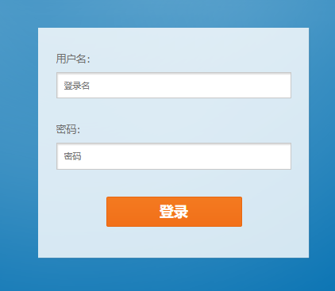

# Spring Security

## 入门

### 最简单的案例

从一个 demo 入手，实现一个最简单的案例

创建一个 spring boot 项目，在 maven 中引入依赖

```xml
<dependency>
    <groupId>org.springframework.boot</groupId>
    <artifactId>spring-boot-starter-security</artifactId>
</dependency>
```

创建一个 HelloController

```java
package com.fan.springsecuritybasic.web;

import org.springframework.web.bind.annotation.GetMapping;
import org.springframework.web.bind.annotation.RestController;

@RestController
public class HelloController {

    @GetMapping("/hello")
    public String hello() {
        return "hello";
    }
}
```

运行项目，访问 /hello 接口 `http://localhost:8080/hello`，会发现它会自动跳到 login 页面


用户名默认是 user

密码在控制台有显示


登录后就会跳到 hello 页面


访问 `http://localhost:8080/logout` 即可退出登录


### 自定义登录页

写一个自定义的登录页放到静态资源目录下


添加一个 Security 配置类

```java
package com.fan.springsecuritybasic.config;

import org.springframework.context.annotation.Bean;
import org.springframework.context.annotation.Configuration;
import org.springframework.security.config.annotation.web.builders.HttpSecurity;
import org.springframework.security.config.annotation.web.configurers.AbstractHttpConfigurer;
import org.springframework.security.web.SecurityFilterChain;

@Configuration
public class SecurityConfig {

    @Bean
    public SecurityFilterChain securityFilterChain(HttpSecurity http) throws Exception {
        //自定义自己编写的登陆页面
        http.authorizeHttpRequests(authorizeRequests -> {
            authorizeRequests.requestMatchers("/css/**", "/images/**").permitAll().anyRequest().authenticated();
        }).formLogin(formLogin -> {
            formLogin.loginPage("/login.html").loginProcessingUrl("/login").permitAll(); // 登录页和登录访问路径无需登录也可以访问
        }).csrf(AbstractHttpConfigurer::disable); // 关闭csrf防护
        return http.build();
    }
}
```

访问 /login 即可看到自定义的登录页面




### 获取登录用户信息

```java
package com.fan.springsecuritybasic.web;

import org.springframework.security.core.Authentication;
import org.springframework.security.core.context.SecurityContextHolder;
import org.springframework.web.bind.annotation.GetMapping;
import org.springframework.web.bind.annotation.RestController;

@RestController
public class HelloController {

    @GetMapping("/hello")
    public String hello() {
        // 获取登录的用户信息
        Authentication authentication = SecurityContextHolder.getContext().getAuthentication();
        String name = authentication.getName();
        return "hello" + name;
    }
}

```


### 基本原理

Spring-Security其内部基础的处理方式就是通过过滤器来实现的，来我们看下刚才的例子用到的一些过滤器，如图所示：


这几个过滤器都是干啥的呢？

- UsernamePasswordAuthenticationFilter:负责处理我们在登陆页面填写了用户名密码后的登陆请求。入门案例的认证工作主要有它负责。
- ExceptionTranslationFilter：处理过滤器链中抛出的任何AccessDeniedException和AuthenticationException。
- FilterSecurityInterceptor：负责权限校验的过滤器。

### 认证

#### 基于内存模型实现认证

修改配置类SecurityConfig 添加两个bean的配置

```java
import org.springframework.security.core.userdetails.UserDetailsService;
import org.springframework.security.crypto.password.NoOpPasswordEncoder;

@Bean
PasswordEncoder passwordEncoder() {
    return NoOpPasswordEncoder.getInstance();
}

@Bean
public UserDetailsService userDetailsService() {
    UserDetails user = User.builder()
        .username("user")
        .password("123456")
        .roles("USER")
        .build();

    UserDetails admin = User.builder()
        .username("admin")
        .password("112233")
        .roles("ADMIN", "USER")
        .build();
    // InMemoryUserDetailsManager 内存中的用户存储器，将用户信息保存在 Java 内存中
    return new InMemoryUserDetailsManager(user, admin);
}
```

Spring Security 提供了一个 **UserDetails** 的实现类 **User**，用于用户信息的实例表示。另外，**User** 提供 **Builder** 模式的对象构建方式。

#### BCrypt 密码加密

明文肯定是不安全的，可以使用BCrypt进行加密

BCrypt生成的密文长度是60，而MD5的长度是32

修改配置类SecurityConfig  的passwordEncoder实现类为BCryptPasswordEncoder

```java
@Bean
PasswordEncoder passwordEncoder() {
    return new BCryptPasswordEncoder();
}
```

修改配置类SecurityConfig 的users方法中的密码，为加密后的密码

```java
@Bean
public UserDetailsService users() {
    UserDetails user = User.builder()
            .username("user")
            .password("$2a$10$PGl7zqu98x8iihvz7KYsZugs7Gw.qMJaRC9FbGTNHUXtsYfGmIkU6")
            .roles("USER")
            .build();
    UserDetails admin = User.builder()
            .username("admin")
            .password("$2a$10$PGl7zqu98x8iihvz7KYsZugs7Gw.qMJaRC9FbGTNHUXtsYfGmIkU6")
            .roles("USER", "ADMIN")
            .build();
    return new InMemoryUserDetailsManager(user, admin);
}
```

####  基于JDBC数据库实现认证

登录页的认证流程


新创建一个UserDetailsServiceImpl，让它实现UserDetailsService

```java
@Component
public class UserDetailsServiceImpl  implements UserDetailsService {


    @Override
    public UserDetails loadUserByUsername(String username) throws UsernameNotFoundException {

        if(username.equals("user")){
            UserDetails user= User.builder()
                    .username("user")                  .password("$2a$10$PGl7zqu98x8iihvz7KYsZugs7Gw.qMJaRC9FbGTNHUXtsYfGmIkU6")
                    .roles("USER")
                    .build();
            return user;
        }
        if(username.equals("admin")){
            UserDetails admin= User.builder()
                    .username("admin")                    .password("$2a$10$PGl7zqu98x8iihvz7KYsZugs7Gw.qMJaRC9FbGTNHUXtsYfGmIkU6")
                    .roles("ADMIN","USER")
                    .build();
            return admin;
        }
        return null;
    }
}
```

- 当前对象需要让spring容器管理，所以在类上添加注解@Component
- 注意一下loadUserByUsername方法的返回值是UserDetails，这也是框架给提供了保存用户的类，并且也是一个接口，如果我们有自定义的用户信息存储，可以实现这个接口

既然以上能使用这个类来查询用户信息，那么我们之前在SecurityConfig中定义的用户信息，可以注释掉了

```java
//    @Bean
//    public UserDetailsService userDetailsService() {
//        UserDetails user = User.builder()
//                .username("user")
//                .password("123456")
//                .roles("USER")
//                .build();
//
//        UserDetails admin = User.builder()
//                .username("admin")
//                .password("123456")
//                .roles("ADMIN", "USER")
//                .build();
//        // InMemoryUserDetailsManager 内存中的用户存储器，将用户信息保存在 Java 内存中
//        return new InMemoryUserDetailsManager(user, admin);
//    }
```

当然，这是写死的密码，接下来实现连接数据库查询用户，主要步骤：

- 导入相关依赖（数据库、mybaits、lombok等）
- 添加配置：连接数据库、mybatis配置等（application.yml）
- 编写实体类和mapper
- 改造UserDetailsServiceImpl（用户从数据库中获取）

创建一个数据库 security_demo 和用户表 sys_user

```sql
SET NAMES utf8mb4;
SET FOREIGN_KEY_CHECKS = 0;

-- ----------------------------
-- Table structure for sys_user
-- ----------------------------
DROP TABLE IF EXISTS `sys_user`;
CREATE TABLE `sys_user`  (
  `id` bigint(0) NOT NULL AUTO_INCREMENT COMMENT '用户ID',
  `username` varchar(30) CHARACTER SET utf8mb3 COLLATE utf8mb3_bin NULL DEFAULT NULL COMMENT '用户账号',
  `open_id` varchar(36) CHARACTER SET utf8mb3 COLLATE utf8mb3_general_ci NULL DEFAULT NULL COMMENT 'open_id标识',
  `password` varchar(100) CHARACTER SET utf8mb3 COLLATE utf8mb3_bin NOT NULL DEFAULT '' COMMENT '密码',
  `user_type` varchar(2) CHARACTER SET utf8mb3 COLLATE utf8mb3_bin NULL DEFAULT '00' COMMENT '用户类型（0:系统用户,1:客户）',
  `avatar` varchar(100) CHARACTER SET utf8mb3 COLLATE utf8mb3_bin NULL DEFAULT '' COMMENT '头像地址',
  `nick_name` varchar(30) CHARACTER SET utf8mb3 COLLATE utf8mb3_bin NULL DEFAULT NULL COMMENT '用户昵称',
  `email` varchar(50) CHARACTER SET utf8mb3 COLLATE utf8mb3_bin NULL DEFAULT '' COMMENT '用户邮箱',
  `real_name` varchar(30) CHARACTER SET utf8mb3 COLLATE utf8mb3_bin NULL DEFAULT NULL COMMENT '真实姓名',
  `mobile` varchar(11) CHARACTER SET utf8mb3 COLLATE utf8mb3_bin NULL DEFAULT '' COMMENT '手机号码',
  `sex` char(1) CHARACTER SET utf8mb3 COLLATE utf8mb3_bin NULL DEFAULT '0' COMMENT '用户性别（0男 1女 2未知）',
  `data_state` char(1) CHARACTER SET utf8mb3 COLLATE utf8mb3_bin NOT NULL DEFAULT '0' COMMENT '数据状态（0正常 1停用）',
  `dept_no` varchar(22) CHARACTER SET utf8mb3 COLLATE utf8mb3_bin NULL DEFAULT NULL COMMENT '部门编号',
  `post_no` varchar(22) CHARACTER SET utf8mb3 COLLATE utf8mb3_bin NULL DEFAULT NULL COMMENT '岗位编号',
  `create_time` datetime(0) NOT NULL COMMENT '创建时间',
  `update_time` datetime(0) NULL DEFAULT NULL COMMENT '更新时间',
  `remark` varchar(500) CHARACTER SET utf8mb3 COLLATE utf8mb3_bin NULL DEFAULT NULL COMMENT '备注',
  `create_by` bigint(0) NULL DEFAULT NULL COMMENT '创建者',
  `update_by` bigint(0) NULL DEFAULT NULL COMMENT '更新者',
  `is_leader` int(0) NULL DEFAULT 0 COMMENT '是否是部门leader(0:否，1：是)',
  `is_delete` int(0) NULL DEFAULT NULL COMMENT '是否删除',
  PRIMARY KEY (`id`) USING BTREE,
  UNIQUE INDEX `real_name`(`real_name`) USING BTREE,
  UNIQUE INDEX `email`(`email`) USING BTREE
) ENGINE = InnoDB AUTO_INCREMENT = 1671403256519078165 CHARACTER SET = utf8mb3 COLLATE = utf8mb3_bin COMMENT = '用户表' ROW_FORMAT = Dynamic;

-- ----------------------------
-- Records of sys_user
-- ----------------------------
INSERT INTO `sys_user` VALUES (1671403256519078138, 'user@qq.com', '', '$2a$10$RO7UWfrT72ZQmJIk/7n2BODBwHEDr3FgLKlHj9DUsCai0FMe6BBXy', '0', NULL, '超级管理员', 'admin@qq.com', '超级管理员', '15156409998', '0', '1', '100001000000000', '100001001000000', '2023-06-19 23:11:17', '2023-07-12 16:26:01', '', 1668522280851951617, 1671403256519078079, 0, 0);
INSERT INTO `sys_user` VALUES (1671403256519078147, 'admin@qq.com', NULL, '$2a$10$VfWGyuZ0Dm2MzvgQ8ien1unEItD6bkZnelURrmjCPO9zS4KjVfiv.', NULL, NULL, '院长', 'yz@qq.com', '院长', '', '', '0', '100001001000000', '100001001001000', '2023-09-26 14:09:28', '2023-09-26 14:09:28', NULL, 1671403256519078138, NULL, 1, 0);

SET FOREIGN_KEY_CHECKS = 1;
```

导入相关依赖

```xml
<dependency>
    <groupId>com.alibaba</groupId>
    <artifactId>druid-spring-boot-starter</artifactId>
    <version>1.2.20</version>
</dependency>
<dependency>
    <groupId>org.mybatis.spring.boot</groupId>
    <artifactId>mybatis-spring-boot-starter</artifactId>
    <version>3.0.3</version>
</dependency>
<dependency>
    <groupId>mysql</groupId>
    <artifactId>mysql-connector-java</artifactId>
    <version>8.0.19</version>
</dependency>
```

配置数据库连接

```yaml
#服务配置
server:
  #端口
  port: 8080
spring:
  application:
    name: springsecurity-demo
  #数据源配置
  datasource:
    driver-class-name: com.mysql.cj.jdbc.Driver
    url: jdbc:mysql://127.0.0.1:3306/security_demo?useUnicode=true&characterEncoding=utf8&serverTimezone=Asia/Shanghai
    username: root
    password: Fan0124.
# MyBatis配置
mybatis:
  #mapper配置文件
  mapper-locations: classpath*:mapper*/*Mapper.xml
  type-aliases-package: com.fan.springscuritybasic.entity
  configuration:
    # 这个配置会将执行的sql打印出来，在开发或测试的时候可以用
    log-impl: org.apache.ibatis.logging.stdout.StdOutImpl
    # 驼峰下划线转换
    map-underscore-to-camel-case: true
    use-generated-keys: true
    default-statement-timeout: 60
    default-fetch-size: 100
```

添加 User 实体类

```java
package com.fan.springsecuritybasic.entity;

import lombok.Data;

import java.time.LocalDateTime;

@Data
public class User {

    public Long id;

    /**
     * 用户账号
     */
    private String username;

    /**
     * open_id标识
     */
    private String openId;

    /**
     * 密码
     */
    private String password;

    /**
     * 用户类型（0:系统用户,1:客户）
     */
    private String userType;

    /**
     * 头像地址
     */
    private String avatar;

    /**
     * 用户昵称
     */
    private String nickName;

    /**
     * 用户邮箱
     */
    private String email;

    /**
     * 真实姓名
     */
    private String realName;

    /**
     * 手机号码
     */
    private String mobile;

    /**
     * 用户性别（0男 1女 2未知）
     */
    private String sex;

    /**
     * 数据状态（0正常 1停用）
     */
    private String dataState;

    /**
     * 创建时间
     */
    public LocalDateTime createTime;

    /**
     * 更新时间
     */
    public LocalDateTime updateTime;

    /**
     * 创建人
     */
    private Long createBy;

    /**
     * 更新人
     */
    private Long updateBy;

    /**
     * 备注
     */
    private String remark;
}
```

UserMapper

```java
package com.fan.springsecuritybasic.mapper;

import com.fan.springsecuritybasic.entity.User;
import org.apache.ibatis.annotations.Mapper;
import org.apache.ibatis.annotations.Select;


@Mapper
public interface UserMapper {

    @Select("select * from sys_user where username = #{username}")
    public User findByUsername(String username);
}
```

改造 UserDetailsServiceImpl

```java
package com.fan.springsecuritybasic.service;

import com.fan.springsecuritybasic.entity.User;
import com.fan.springsecuritybasic.mapper.UserMapper;
import com.fan.springsecuritybasic.vo.UserAuth;
import org.springframework.beans.factory.annotation.Autowired;
import org.springframework.security.core.GrantedAuthority;
import org.springframework.security.core.authority.SimpleGrantedAuthority;
import org.springframework.security.core.userdetails.UserDetails;
import org.springframework.security.core.userdetails.UserDetailsService;
import org.springframework.security.core.userdetails.UsernameNotFoundException;
import org.springframework.stereotype.Component;

import java.util.ArrayList;
import java.util.List;

@Component
public class UserDetailsServiceImpl implements UserDetailsService {

    @Autowired
    private UserMapper userMapper;

    @Override
    public UserDetails loadUserByUsername(String username) throws UsernameNotFoundException {
        // 查询用户
        User user = userMapper.findByUsername(username);
        if(user == null){
            throw new RuntimeException("用户不存在或已被禁用");
        }

        SimpleGrantedAuthority user_role = new SimpleGrantedAuthority("user");
        SimpleGrantedAuthority admin_role = new SimpleGrantedAuthority("admin");
        List<GrantedAuthority> list = new ArrayList<GrantedAuthority>();

        list.add(user_role);
        list.add(admin_role);

        return new org.springframework.security.core.userdetails.User(user.getUsername()
            ,user.getPassword()
            , list);
    }
}
```

上述代码中，返回的UserDetails或者是User都是框架提供的类，我们在项目开发的过程中，很多需求都是我们自定义的属性，我们需要扩展该怎么办？

其实，我们可以自定义一个类，来实现UserDetails，在自己定义的类中，就可以扩展自己想要的内容，如下代码：

```java
package com.fan.springsecuritybasic.vo;

import lombok.Data;
import org.springframework.security.core.GrantedAuthority;
import org.springframework.security.core.authority.SimpleGrantedAuthority;
import org.springframework.security.core.userdetails.UserDetails;

import java.util.Collection;
import java.util.List;
import java.util.stream.Collectors;

@Data
public class UserAuth implements UserDetails {

    private String username; //固定不可更改
    private String password;//固定不可更改
    private String nickName;  //扩展属性  昵称
    private List<String> roles; //角色列表


    @Override
    public Collection<? extends GrantedAuthority> getAuthorities() {
        if(roles==null) return null;
        //把角色类型转换并放入对应的集合
        return roles.stream().map(role -> new SimpleGrantedAuthority("ROLE_"+role)).collect(Collectors.toList());
    }

    @Override
    public boolean isAccountNonExpired() {
        return true;
    }

    @Override
    public boolean isAccountNonLocked() {
        return true;
    }

    @Override
    public boolean isCredentialsNonExpired() {
        return true;
    }

    @Override
    public boolean isEnabled() {
        return true;
    }
}
```

改造UserDetailsServiceImpl

```java
@Component
public class UserDetailServiceImpl implements UserDetailsService {

    @Autowired
    private UserMapper userMapper;

    @Override
    public UserDetails loadUserByUsername(String username) throws UsernameNotFoundException {
        //查询用户
        User user = userMapper.findByUsername(username);
        if(user == null){
            throw new RuntimeException("用户不存在或已被禁用");
        }
        
        UserAuth userAuth = new UserAuth();
        userAuth.setUsername(user.getUsername());
        userAuth.setPassword(user.getPassword());
        userAuth.setNickName(user.getNickName());

        //添加角色
        List<String> roles = new ArrayList<>();
        if("user@qq.com".equals(username)){
            roles.add("USER");
            userAuth.setRoles(roles);
        }
        if("admin@qq.com".equals(username)){
            roles.add("USER");
            roles.add("ADMIN");
            userAuth.setRoles(roles);
        }
        return userAuth;
    }
}
```

在 HelloController中使用getPrincipal()方法读取认证主体对象

```java
@RequestMapping("/hello")
public String hello() {
    // 获取登录的用户信息
    Authentication authentication = SecurityContextHolder.getContext().getAuthentication();
    String name = authentication.getName();
    // 取出认证主体对象
    UserAuth userAuth = (UserAuth)SecurityContextHolder.getContext().getAuthentication().getPrincipal();
    return "hello " + name + " " + userAuth.getNickName();
}
```

